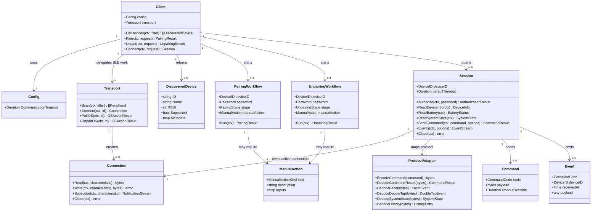

# TimeFlip2 Golang Library

## Requirements

Implement a small, reusable Go library for TimeFlip2 devices that lets consuming applications discover supported BLE devices, run staged pairing and unpairing workflows, connect with caller-supplied inputs, read and write supported device data, send supported non-firmware commands, receive device events through Go channels, and configure communication timeouts without depending on the mobile app or cloud API.

The library must target MacOS first while keeping BLE transport concerns behind interfaces for later platform support. It must hide raw BLE protocol details from the primary integration API, avoid interpreting time-tracking business meaning, avoid classifying operation sensitivity, and avoid library-owned storage or caching of device state outside active workflow/session objects.

## Entities

## Approach

1. Public Library API:
   - Create a root Go package that exposes `Client`, `Session`, request/result types, event types, command types, and timeout options.
   - Keep integrators on high-level operations: list devices, pair, unpair, connect, read state, write configuration, send commands, subscribe to events, and close sessions.
   - Return staged workflow results for pairing and unpairing so callers can recover from password failures, unsupported OS operations, unavailable devices, and manual-action requirements.
   - Keep all long-running operations `context.Context` aware and apply a global communication timeout unless a command-level timeout override is provided.

2. Transport and Protocol Boundaries:
   - Define a small BLE `Transport` interface and `Connection` interface in an internal or platform package so MacOS support can be added first without binding the whole library to one BLE implementation.
   - Implement TimeFlip2 protocol constants and parsing in a dedicated protocol package, including service UUIDs, characteristic UUIDs, command encoding, command-result decoding, password authorization, facet/double-tap/system-state/history parsing, and error mapping.
   - Keep protocol byte details out of the primary API while preserving diagnostic information inside typed errors and command results.

3. Pairing, Unpairing, and Statelessness:
   - Treat pairing as a staged process for a new or reset device: discover supported device, connect, perform OS-level pairing only where the OS adapter supports it, authorize or set password as required, verify usable state, and return stage outcomes.
   - Treat unpairing as a staged process: connect if reachable, perform supported device-specific reset/password behavior, attempt OS-level unpairing where supported, and otherwise return the action inputs needed for user- or caller-initiated OS unpairing.
   - Do not create a registry, cache, file store, in-memory remembered-device map, or password store. Any device identity, password, labels, task mapping, or last-known state across calls belongs to consuming applications.

4. Events and Command Behavior:
   - Expose typed technical events for connection state, facet change, double tap, battery change, system state, history entry, command result, and raw/unknown device event.
   - Avoid interpreting tasks, billable time, or user workflow decisions. A facet event identifies a facet; consuming apps decide what it means.
   - Expose supported non-firmware commands consistently without classifying reads or writes by sensitivity. Keep firmware update and firmware-loader behavior out of scope.

5. Verification and Documentation:
   - Build protocol unit tests with fixture byte payloads from the hardware docs.
   - Build client/session tests against fake transports and fake connections to validate staged workflows, timeouts, event channel behavior, unsupported OS actions, and no retained state.
   - Provide integration documentation and examples that show discovery, pairing, connection, authorization, command timeout overrides, event consumption, unpairing, and manual-action handling.

## Structure

### Inheritance Relationships

1. `Transport` interface defines platform BLE scanning, connection, OS pairing, and OS unpairing capabilities.
2. `Connection` interface defines characteristic read, write, notification subscription, and close behavior.
3. `Client` depends on `Transport` and creates `Session`, `PairingWorkflow`, and `UnpairingWorkflow` values.
4. `Session` owns one active `Connection` and uses `ProtocolAdapter` functions to translate device data.
5. Error types implement the Go `error` interface and support `errors.Is` / `errors.As` where practical.

### Dependencies

1. Public package calls internal protocol code for TimeFlip2 command and event conversion.
2. Public package calls transport interfaces for BLE behavior and does not import a MacOS adapter directly unless using a convenience constructor.
3. MacOS adapter implements transport interfaces and owns OS-specific BLE permission, scan, connect, subscribe, pairing, and unpairing behavior.
4. Tests use fake transport and fake connection implementations to verify library behavior without hardware.
5. Examples depend only on the public package and the MacOS convenience adapter.

### Layered Architecture

1. Public API Layer: `Client`, `Session`, request/result types, commands, events, options, and documented error values.
2. Workflow Layer: pairing and unpairing stage orchestration, manual-action results, timeout application, and context cancellation.
3. Protocol Layer: TimeFlip2 UUID constants, command encoding, response decoding, notification parsing, history parsing, and device support detection.
4. Transport Layer: platform-neutral BLE interfaces and MacOS implementation.
5. Test and Documentation Layer: protocol fixtures, fake transport tests, examples, README usage, and hardware smoke-test notes.

## Operations

### Create Module and Package Layout - Go Library Skeleton

1. Responsibility: Initialize a Go library module and establish package boundaries for public API, protocol logic, transport interfaces, MacOS adapter, examples, and tests.
2. Files:
   - `go.mod`: module definition using module path `github.com/mitchellrj/timeflip-go`.
   - `client.go`, `session.go`, `types.go`, `errors.go`, `options.go`: public API package files.
   - `internal/protocol/*.go`: TimeFlip2 protocol constants, command encoding, and decoding.
   - `internal/transport/*.go`: transport and connection interfaces plus fake implementations for tests.
   - `macos/*.go`: MacOS BLE adapter package.
   - `examples/basic/main.go`: minimal integration example.
   - `README.md`: integrator documentation.
3. Logic:
   - Initialize the module with Go 1.22 or newer.
   - Keep public API names stable and small.
   - Keep OS-specific code out of protocol and workflow packages.
4. Completion Criteria:
   - `go test ./...` can run before hardware-dependent code is available.
   - No package stores remembered device state beyond active objects.

### Implement Public Configuration and Options - Config, CommandOptions, EventOptions

1. Responsibility: Define communication timeout behavior and common operation options.
2. Attributes:
   - `Config.CommunicationTimeout time.Duration`: global timeout applied to BLE communication when operation-specific overrides are absent.
   - `CommandOptions.Timeout time.Duration`: optional per-command timeout override.
   - `EventOptions.Buffer int`: optional event channel buffer size.
   - `EventOptions.IncludeRaw bool`: optional inclusion of raw payload data in events.
3. Methods:
   - `func NewClient(transport Transport, config Config) (*Client, error)`
     - Validate non-nil transport.
     - Apply a sensible default communication timeout when unset.
     - Reject negative timeouts.
   - `func timeoutFrom(ctx context.Context, base time.Duration, override time.Duration) (context.Context, context.CancelFunc)`
     - Use override when positive.
     - Use base when override is zero.
     - Preserve caller cancellation.
4. Constraints:
   - Support exactly one global communication timeout plus optional command overrides.
   - Do not introduce separate timeout categories for scan, connect, read, write, subscribe, or history.

### Implement Error Model - Typed Go Errors

1. Responsibility: Provide actionable, typed errors without leaking unnecessary implementation details.
2. Error Types:
   - `ErrUnsupportedDevice`: discovered peripheral does not match TimeFlip2 support criteria.
   - `ErrUnsupportedOperation`: OS pairing/unpairing or device command is not supported by the active adapter.
   - `ErrAuthorizationFailed`: password authorization failed or device remained blocked.
   - `ErrCommandRejected`: device returned command error status.
   - `ErrProtocol`: device payload could not be parsed or violated protocol expectations.
   - `ErrTimeout`: operation exceeded the applicable communication timeout.
   - `ErrDisconnected`: connection ended before the operation completed.
3. Methods:
   - `func IsTimeout(err error) bool`
   - `func IsUnsupported(err error) bool`
   - `func IsAuthorization(err error) bool`
4. Constraints:
   - Include device ID, operation name, command code, and stage when useful.
   - Support `errors.Is` and `errors.As`.
   - Do not log or store passwords.

### Implement Transport Interfaces - BLE Abstraction

1. Responsibility: Define platform-neutral BLE contracts used by the library.
2. Interface Definition:
   - `type Transport interface { Scan(context.Context, ScanFilter) ([]Peripheral, error); Connect(context.Context, DeviceID) (Connection, error); PairOS(context.Context, DeviceID) (OSActionResult, error); UnpairOS(context.Context, DeviceID) (OSActionResult, error) }`
   - `type Connection interface { Read(context.Context, CharacteristicID) ([]byte, error); Write(context.Context, CharacteristicID, []byte) error; Subscribe(context.Context, CharacteristicID) (<-chan Notification, error); Close(context.Context) error }`
3. Core Types:
   - `Peripheral`: device ID, name, RSSI, advertised service IDs, manufacturer data, and metadata.
   - `OSActionResult`: performed flag, unsupported flag, manual action details, and adapter-specific inputs.
4. Logic:
   - `PairOS` and `UnpairOS` must return `ErrUnsupportedOperation` plus a populated `ManualAction` when the OS API cannot directly perform the action but the caller can proceed manually.
   - Fake transport must allow deterministic scan, connect, read, write, subscribe, disconnect, and unsupported OS action tests.
5. Constraints:
   - Transport interfaces must not contain TimeFlip2-specific command names.
   - Transport implementations must not retain device state beyond their active connections.

### Implement Protocol Constants and Device Detection - TimeFlip2 UUID Map

1. Responsibility: Encode the documented TimeFlip2 services and characteristics.
2. Constants:
   - Generic Access service `0x1800`, Device Name `0x2A00`.
   - Device Information service `0x180A`, Manufacturer `0x2A29`, Model `0x2A24`, Hardware Revision `0x2A27`, Firmware Revision `0x2A26`, System ID `0x2A23`.
   - Battery service `0x180F`, Battery Level `0x2A19`.
   - TimeFlip service `F1196F50-71A4-11E6-BDF4-0800200C9A66`.
   - TimeFlip events `F1196F51-71A4-11E6-BDF4-0800200C9A66`.
   - Facets `F1196F52-71A4-11E6-BDF4-0800200C9A66`.
   - Command result output `F1196F53-71A4-11E6-BDF4-0800200C9A66`.
   - Command `F1196F54-71A4-11E6-BDF4-0800200C9A66`.
   - Double tap `F1196F55-71A4-11E6-BDF4-0800200C9A66`.
   - System state `F1196F56-71A4-11E6-BDF4-0800200C9A66`.
   - Password check `F1196F57-71A4-11E6-BDF4-0800200C9A66`.
   - History data `F1196F58-71A4-11E6-BDF4-0800200C9A66`.
3. Methods:
   - `func IsSupportedPeripheral(p Peripheral) bool`
     - Prefer advertised TimeFlip service UUID when present.
     - Fall back to name/model heuristics only when service advertising is incomplete.
   - `func RequiredCharacteristics() []CharacteristicID`
4. Constraints:
   - Tests must cover positive and negative support detection.
   - Device matching must be documented as best effort until hardware validation confirms advertisement behavior.

### Implement Protocol Command Encoding and Decoding - Commands

1. Responsibility: Convert library commands to documented TimeFlip2 command bytes and convert command responses to typed results.
2. Commands:
   - Lock on/off: `0x04 0x01`, `0x04 0x02`.
   - Auto-pause: `0x05` plus delay minutes.
   - Pause on/off: `0x06 0x01`, `0x06 0x02`.
   - Read time: `0x07`.
   - Set time: `0x08` plus Unix seconds.
   - LED brightness: `0x09` plus percentage.
   - LED blink period: `0x0A` plus seconds.
   - Status request: `0x10`.
   - Facet color: `0x11` plus facet and RGB values.
   - Task parameters: `0x13` plus facet, mode, and timer.
   - Read task parameters: `0x14` plus facet.
   - Device name: `0x15` plus ASCII length and name.
   - Tap settings write/read: `0x16`, `0x17`.
   - Set password: `0x30` plus six ASCII bytes.
   - Reset task info: `0xFE`.
   - Factory reset: `0xFF`.
3. Methods:
   - `func EncodeCommand(cmd Command) ([]byte, error)`
   - `func DecodeCommandStatus(payload []byte) (CommandStatus, error)`
   - `func DecodeStatusResponse(payload []byte) (TrackerStatus, error)`
4. Logic:
   - Enforce documented payload sizes and value ranges.
   - Exclude firmware update and firmware-loader commands from public supported command constructors.
   - Treat read and write operations consistently; do not classify sensitivity.
5. Tests:
   - Validate command byte output for each supported command.
   - Validate OK/error response decoding where command status bytes are documented.
   - Validate out-of-range values return validation errors.

### Implement Protocol Data Decoding - Device State and Events

1. Responsibility: Decode readable state and notification payloads into typed technical values.
2. Methods:
   - `func DecodeDeviceInfo(values map[CharacteristicID][]byte) (DeviceInfo, error)`
   - `func DecodeBattery(payload []byte) (BatteryStatus, error)`
   - `func DecodeFacet(payload []byte) (FacetEvent, error)`
   - `func DecodeDoubleTap(payload []byte) (DoubleTapEvent, error)`
   - `func DecodeSystemState(payload []byte) (SystemState, error)`
   - `func DecodeHistory(payload []byte) ([]HistoryEntry, HistoryStreamState, error)`
3. Logic:
   - Battery level must be parsed as 1-100 percentage when present.
   - Facet payload must distinguish undefined facet, normal facet, and wrong-password zero where context makes that knowable.
   - Double-tap payload below 128 means pause off with the facet value; payload 128 or above means pause on and facet value is payload minus 128.
   - System state must expose sync requirements and hardware issue values without deciding application behavior.
   - History parsing must handle single-entry reads, full stream packets, zero terminators, pause-encoded sides, undefined side value, accelerometer error side value, timestamps, durations, and previous-event references.
4. Constraints:
   - Preserve raw payload on decoded values where useful for diagnostics.
   - Return protocol errors for malformed lengths.
   - Do not interpret facet IDs as task labels.

### Implement Client Discovery - ListDevices

1. Responsibility: Let consuming apps list supported TimeFlip2 devices in range.
2. Method:
   - `func (c *Client) ListDevices(ctx context.Context, filter ScanFilter) ([]DiscoveredDevice, error)`
3. Logic:
   - Apply communication timeout to scan operation.
   - Call `Transport.Scan`.
   - Convert peripherals to discovered devices.
   - Mark or filter by TimeFlip2 support according to `ScanFilter`.
   - Return ID, name, RSSI, support status, and non-sensitive metadata available from advertisements.
4. Edge Cases:
   - Empty result returns an empty slice, not nil error.
   - Unsupported peripherals are omitted by default but can be included by filter.
   - Timeout and Bluetooth permission errors are returned clearly.
5. Completion Criteria:
   - Fake transport tests cover supported, unsupported, empty, timeout, and scan error cases.

### Implement Pairing Workflow - New or Reset Device

1. Responsibility: Pair a new or reset TimeFlip2 device across TimeFlip-specific and OS-supported steps.
2. Method:
   - `func (c *Client) Pair(ctx context.Context, req PairRequest) (PairingResult, error)`
3. Request Attributes:
   - `DeviceID DeviceID`
   - `Password string`
   - `NewPassword string`
   - `AllowOSPairing bool`
   - `Timeout time.Duration`
4. Result Attributes:
   - `DeviceID DeviceID`
   - `Completed bool`
   - `Stage PairingStage`
   - `Stages []StageResult`
   - `ManualAction *ManualAction`
5. Logic:
   - Validate device ID and password inputs required for the requested flow.
   - Treat `PairRequest.Password` as optional; require it only when the device already has a current password configured.
   - Connect to the device using the requested device ID.
   - If OS pairing is allowed, call `Transport.PairOS` and record performed, unsupported, or manual-action result.
   - Authorize using the current password through the password characteristic only when `PairRequest.Password` is non-empty.
   - If no current password is supplied, skip the authorize stage and continue with optional password setup and verification.
   - If requested, set a new six-character password using the supported command.
   - Verify usable state by reading a protected characteristic or command result.
   - Return completed result or partial staged result with recoverable error details.
6. Constraints:
   - Do not store passwords or paired device IDs.
   - Do not persist stage history outside the returned result.
   - Wrong password must return authorization failure with the stage captured.

### Implement Unpairing Workflow - Device Reset and OS Unpair

1. Responsibility: Unpair a device through supported device-side reset/password behavior and OS-level unpairing where available.
2. Method:
   - `func (c *Client) Unpair(ctx context.Context, req UnpairRequest) (UnpairingResult, error)`
3. Request Attributes:
   - `DeviceID DeviceID`
   - `Password string`
   - `FactoryReset bool`
   - `AllowOSUnpairing bool`
   - `Timeout time.Duration`
4. Logic:
   - If the device is reachable and password is supplied, connect and authorize.
   - Perform requested device-specific reset using supported non-firmware commands, including factory reset command when explicitly requested by the caller.
   - If OS unpairing is allowed, call `Transport.UnpairOS`.
   - If OS unpairing is unsupported, return `ManualAction` with required device ID and adapter-provided instructions or inputs.
   - Return staged result that distinguishes device-side completion from OS-side completion.
5. Edge Cases:
   - Device not in range may skip device-specific reset and still attempt OS unpairing where supported.
   - OS unpairing unsupported is not the same as total workflow failure when manual action is returned.
6. Constraints:
   - Do not remove any library registry entry because no registry exists.
   - Do not classify factory reset as sensitive inside the library; caller owns policy.

### Implement Session Lifecycle - Connect, Authorize, Close

1. Responsibility: Manage an active device connection without retaining state after close.
2. Methods:
   - `func (c *Client) Connect(ctx context.Context, req ConnectRequest) (*Session, error)`
   - `func (s *Session) Authorize(ctx context.Context, password string) (AuthorizationResult, error)`
   - `func (s *Session) Close(ctx context.Context) error`
3. Logic:
   - Validate device ID.
   - Apply communication timeout to connection.
   - Create a session with device ID, connection, default timeout, and protocol adapter.
   - Write six-byte password to password characteristic during authorization.
   - Read command result or protected characteristic to verify authorization when possible.
   - Close subscriptions and connection on `Close`.
4. Constraints:
   - Session may keep active connection configuration and subscription handles only while open.
   - Session must not write to files, global maps, or package-level caches.
   - Close must be idempotent.

### Implement Read APIs - Device Info, Battery, System State, History

1. Responsibility: Read available stored data and configuration from a connected device.
2. Methods:
   - `func (s *Session) ReadDeviceInfo(ctx context.Context) (DeviceInfo, error)`
   - `func (s *Session) ReadBattery(ctx context.Context) (BatteryStatus, error)`
   - `func (s *Session) ReadSystemState(ctx context.Context) (SystemState, error)`
   - `func (s *Session) ReadHistory(ctx context.Context, req HistoryRequest) ([]HistoryEntry, error)`
   - `func (s *Session) ReadTaskParameters(ctx context.Context, facet FacetID, opts CommandOptions) (TaskParameters, error)`
   - `func (s *Session) ReadTapSettings(ctx context.Context, opts CommandOptions) (TapSettings, error)`
3. Logic:
   - Use characteristic reads for simple readable values.
   - `ReadDeviceInfo` must treat individual standard Device Information characteristics as optional: return any fields that can be read, leave unavailable fields blank, and fail only when no Device Information characteristics can be read or a non-optional transport/cancellation error occurs.
   - `ReadDeviceInfo` must format System ID as uppercase hex code text such as `0x517D517D`, not decoded ASCII, while preserving the raw bytes in diagnostics.
   - Use command plus command-result/history characteristic for command-backed reads.
   - Apply global timeout or command override.
   - Return typed state and raw diagnostic bytes where appropriate.
4. Edge Cases:
   - Wrong or missing authorization may surface as empty reads, command rejection, or explicit authorization errors depending on device behavior.
   - Some real devices may omit one or more standard Device Information characteristics; missing optional fields must not cause the whole `ReadDeviceInfo` call to fail.
   - History stream may terminate with zero packet or connection close; distinguish complete from interrupted reads.

### Implement Write and Command APIs - Configuration and Commands

1. Responsibility: Allow callers to write supported writable configuration and send supported commands.
2. Methods:
   - `func (s *Session) SendCommand(ctx context.Context, cmd Command, opts CommandOptions) (CommandResult, error)`
   - `func (s *Session) SetPassword(ctx context.Context, password string, opts CommandOptions) (CommandResult, error)`
   - `func (s *Session) SetName(ctx context.Context, name string, opts CommandOptions) (CommandResult, error)`
   - `func (s *Session) SetLock(ctx context.Context, enabled bool, opts CommandOptions) (CommandResult, error)`
   - `func (s *Session) SetPause(ctx context.Context, enabled bool, opts CommandOptions) (CommandResult, error)`
   - `func (s *Session) SetAutoPause(ctx context.Context, delayMinutes uint16, opts CommandOptions) (CommandResult, error)`
   - `func (s *Session) SetLED(ctx context.Context, brightnessPercent uint8, blinkSeconds uint8, opts CommandOptions) (CommandResult, error)`
   - `func (s *Session) SetFacetColor(ctx context.Context, facet FacetID, color RGB, opts CommandOptions) (CommandResult, error)`
   - `func (s *Session) SetTaskParameters(ctx context.Context, params TaskParameters, opts CommandOptions) (CommandResult, error)`
   - `func (s *Session) SetTapSettings(ctx context.Context, settings TapSettings, opts CommandOptions) (CommandResult, error)`
   - `func (s *Session) ResetTaskInfo(ctx context.Context, opts CommandOptions) (CommandResult, error)`
   - `func (s *Session) FactoryReset(ctx context.Context, opts CommandOptions) (CommandResult, error)`
3. Logic:
   - Validate ranges and payload sizes before writing.
   - Write encoded command to command characteristic.
   - Read command result output or command status as documented.
   - Return `ErrCommandRejected` when device reports command error.
   - Preserve raw command-result payload bytes in `CommandResult.Payload` and `CommandResult.Status.Raw` even when the acknowledgement status byte is malformed and `ErrProtocol` is returned.
4. Constraints:
   - Do not implement firmware update or firmware-loader command as a public supported command.
   - Do not classify operations by sensitivity; all caller-accessible operations follow the same validation and result pattern.

### Implement Event Streaming - Channel-Based Notifications

1. Responsibility: Provide Go channel events from device notifications.
2. Method:
   - `func (s *Session) Events(ctx context.Context, opts EventOptions) (<-chan Event, <-chan error, error)`
3. Logic:
   - Subscribe to facet, double-tap, battery, system-state, TimeFlip events, and history notifications where supported.
   - Decode each notification into typed technical events.
   - TimeFlip events characteristic notifications that do not have a higher-level typed decoder must be emitted as raw technical events instead of surfacing as protocol errors.
   - Event decode errors must include the notification source/characteristic context so consumers can distinguish malformed facet, double-tap, battery, system-state, TimeFlip events, and history notifications.
   - Send unknown but well-formed notifications as raw events when `IncludeRaw` is true.
   - Close event and error channels on context cancellation, subscription failure, session close, or disconnect.
4. Edge Cases:
   - If consumer stops reading, respect buffer size and context cancellation.
   - If one subscription fails during setup, clean up already-started subscriptions.
   - If payload decoding fails, report on error channel and continue only when safe.
5. Constraints:
   - Do not infer active task labels or stop/start time tracking behavior.
   - Event stream must not persist events after channel delivery.

### Implement MacOS Transport Adapter - Initial Platform Support

1. Responsibility: Provide the first concrete BLE transport for MacOS.
2. Files:
   - `macos/transport.go`
   - `macos/connection.go`
   - `macos/errors.go`
3. Logic:
   - Use an appropriate Go BLE library or MacOS bridge selected during implementation.
   - Implement scan, connect, read, write, subscribe, close, OS pairing, and OS unpairing as far as MacOS APIs directly support them.
   - Return `OSActionResult` with manual-action details where direct OS pairing/unpairing is unsupported.
4. Constraints:
   - MacOS package may contain platform-specific build tags.
   - Core public package must remain testable without MacOS BLE availability.
   - Permission and Bluetooth-disabled errors must be surfaced clearly.

### Implement Tests - Protocol, Workflow, Session, Events

1. Responsibility: Verify behavior without requiring hardware in normal tests.
2. Test Groups:
   - Protocol tests for UUIDs, command encoding, command result decoding, battery, facet, double-tap, system state, and history parsing.
   - Client discovery tests using fake transport.
   - Pairing tests for success, wrong password, OS pairing unsupported/manual action, connect failure, timeout, and no state retention.
   - Unpairing tests for reachable device reset, offline OS unpair, unsupported OS unpair/manual action, and staged partial completion.
   - Session tests for authorization, reads, writes, command rejection, close idempotency, and timeout override.
   - Event tests for notification decode, channel closure, decode errors, buffer behavior, cancellation, and disconnect.
3. Completion Criteria:
   - `go test ./...` passes.
   - Tests assert no package-level cache or registry is introduced.
   - Hardware-dependent smoke tests are opt-in and skipped by default.

### Implement Documentation and Examples - Integrator Guidance

1. Responsibility: Help consuming Go applications integrate without reading BLE protocol docs first.
2. Documentation:
   - README overview and installation.
   - Device discovery example.
   - Pairing a new or reset device.
   - Handling OS-level manual actions.
   - Connecting and authorizing.
   - Reading device info, battery, system state, and history.
   - Sending commands with global and per-command timeouts.
   - Receiving channel events.
   - Unpairing and reset behavior.
   - No-storage guarantee and caller-owned persistence guidance.
   - MacOS limitations and future Linux/Windows notes.
3. Examples:
   - `examples/basic/main.go`: scan, connect, authorize, print events.
   - `examples/pairing/main.go`: run staged pairing and display manual action requirements.
4. Constraints:
   - Examples must not embed real passwords in source.
   - Documentation must state that task interpretation belongs to consuming applications.

## Norms

1. Go Style:
   - Use idiomatic Go naming, small interfaces, context-aware methods, and table-driven tests.
   - Keep exported names documented with Go doc comments.
   - Prefer clear concrete types at API boundaries and interfaces at transport boundaries.
2. Package Boundaries:
   - Public package exposes integrator API.
   - Internal protocol package owns TimeFlip2 byte-level behavior.
   - Transport interfaces stay platform-neutral.
   - MacOS adapter stays isolated behind build tags or a dedicated package.
3. Error Handling:
   - Return errors instead of panics.
   - Define sentinel errors and typed wrappers for operation, stage, device ID, and command context.
   - Support `errors.Is` and `errors.As`.
   - Do not include passwords or secret values in errors or logs.
4. Context and Timeout Handling:
   - Every BLE operation accepts `context.Context`.
   - Apply one global communication timeout when no command override is supplied.
   - Command-level timeout overrides apply only to that command operation.
   - Always release timeout cancel functions.
5. State Handling:
   - No library-owned file storage, registry, cache, global remembered-device map, or password store.
   - Active workflow/session state is allowed only for the lifetime of that object.
   - Caller-owned persistence must be represented by explicit inputs, never hidden library memory.
6. Event Handling:
   - Event channels must close cleanly on cancellation, session close, or disconnect.
   - Error channels must not block forever when event consumers stop.
   - Notification goroutines must terminate deterministically in tests.
7. Documentation:
   - Public APIs require doc comments.
   - README and examples must show lifecycle and cleanup.
   - Hardware limitations and MacOS OS-action limitations must be documented plainly.

## Safeguards

1. Functional Constraints:
   - Must support AC1 through AC7: discovery, pairing, unpairing, reads, writes/commands, event channel delivery, and integration docs.
   - Must not implement firmware update behavior.
   - Must not interpret events as user task or time-tracking business actions.
2. Storage Constraints:
   - Must not store or cache device state in files, memory caches, package globals, registries, or retained maps.
   - Must not store passwords.
   - Active pairing, unpairing, and session objects may hold only the state needed for the in-progress operation.
3. OS Integration Constraints:
   - OS-level pairing/unpairing is required only where MacOS APIs directly support it.
   - Unsupported OS-level actions must return actionable manual-action inputs or instructions.
   - Unsupported OS action must be distinguishable from device command failure.
4. Protocol Constraints:
   - Use documented UUIDs and command codes for TimeFlip2 protocol v4.3 as primary reference.
   - Validate command payload sizes and ranges before writes.
   - Treat malformed device payloads as protocol errors.
   - Preserve enough raw data for diagnostics without exposing raw BLE as the primary API.
5. Timeout and Cancellation Constraints:
   - Use one global communication timeout plus optional per-command overrides.
   - All blocking BLE work must observe context cancellation.
   - Timeout errors must identify the operation and stage.
6. Event Constraints:
   - Events must be delivered through Go channels.
   - Channel closure must be deterministic on cancellation, session close, setup failure, or disconnect.
   - Backpressure behavior must be documented and tested.
7. Testing Constraints:
   - Normal tests must not require physical hardware.
   - Fake transport coverage must verify workflows, session lifecycle, unsupported OS actions, and event streaming.
   - Protocol tests must cover valid and malformed payloads.
   - Hardware smoke tests must be opt-in.
8. API Constraints:
   - Primary API must mask BLE characteristic details from integrators.
   - Public methods must return typed results and actionable errors.
   - Read and write operations must not be classified by sensitivity inside the library.
9. Portability Constraints:
   - Initial implementation targets MacOS.
   - Core API and protocol code must remain platform-neutral for future Linux and Windows adapters.
   - MacOS-specific dependencies must not leak into public core types.
