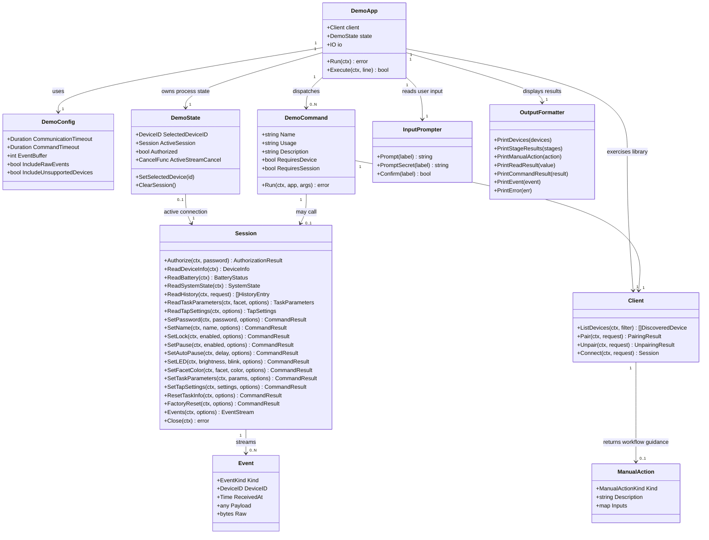

# TimeFlip2 CLI Demo Application

## Requirements

Implement an interactive command-line demo application that lets a user exercise the existing TimeFlip2 Go library against a real device through guided discovery, pairing, connection, authorization, reading, writing, command execution, event streaming, timeout configuration, and unpairing flows.

The demo must serve as executable example code for developers and as a hardware smoke-test harness for the library, while staying thin over the public `timeflip` API, avoiding protocol reimplementation, avoiding event business interpretation, avoiding persistent device/password storage, and remaining MacOS-focused for the initial target.

## Entities

## Approach

1. Interactive CLI Application:
   - Add a dedicated demo command package under `cmd/timeflip-demo` that starts an interactive prompt after parsing startup flags.
   - Keep the CLI as a thin orchestration layer over `timeflip.Client` and `timeflip.Session`; do not duplicate BLE protocol constants, command encoding, event decoding, or transport behavior.
   - Provide a discoverable command set with `help`, `list`, `select`, `pair`, `connect`, `authorize`, `read`, `write`, `command`, `stream`, `stop`, `unpair`, `close`, `status`, and `exit`.
   - Keep existing `examples/basic` and `examples/pairing` as minimal examples; the new demo is the richer exploratory app.

2. Technical Implementation:
   - Use Go standard library packages for argument parsing, interactive input, tabular/labeled output, cancellation, and testing unless an existing dependency already supports the need.
   - Instantiate `timeflip.NewClient(macos.NewTransport(), timeflip.Config{CommunicationTimeout: flagValue})` from the demo entrypoint.
   - Model current device selection, active session, authorization flag, and active event stream cancellation as process-local demo state.
   - Allow a global `-timeout` flag for client communication timeout, a `-command-timeout` flag for command operations, an `-event-buffer` flag for streaming buffer size, an `-include-raw` flag for event display, and an `-include-unsupported` flag for discovery diagnostics.
   - Allow a `-no-color` flag to disable ANSI color output. Color should be enabled by default only when stdout is a supported TTY.
   - Maintain in-process command history for the interactive prompt when stdin/stdout are a supported TTY, with up/down arrow navigation through previous commands.
   - Print contextual errors without terminating the prompt when recovery is possible; exit non-zero only for startup configuration failure or non-interactive fatal setup failure.

3. Business Logic:
   - Guide the user through obvious journeys: discover devices, select a device, pair if needed, connect, authorize, inspect state, write configuration or send commands, stream events, and unpair.
   - Suggest likely next commands after successful or recoverable milestones so the user can continue the demo journey without rereading help.
   - Display library workflow stages and manual actions as first-class outputs so unsupported OS pairing/unpairing is understandable.
   - Require explicit confirmation before disruptive operations: password change, reset task info, factory reset, and unpairing.
   - Do not infer task names, time tracking state, productivity meaning, or business interpretation from facet or tap events.

## Structure

### Inheritance Relationships

1. `timeflip.Transport` and `timeflip.Connection` remain the library extension interfaces; the demo uses the existing `macos.Transport` implementation through the public client constructor.
2. `DemoCommand` is a demo-local command interface or function contract that every interactive command handler follows.
3. `InputPrompter` and `OutputFormatter` are demo-local abstractions to keep command orchestration testable without a real terminal.
4. `DemoApp` owns process-local state and delegates all device behavior to `timeflip.Client` or the active `timeflip.Session`.
5. Existing `OperationError` and sentinel errors remain the error model; the demo formats them without creating a parallel business exception hierarchy.

### Dependencies

1. `cmd/timeflip-demo` depends on the public root package `github.com/mitchellrj/timeflip-go` and the `github.com/mitchellrj/timeflip-go/macos` adapter package.
2. Demo command handlers call `Client.ListDevices`, `Client.Pair`, `Client.Unpair`, `Client.Connect`, and active `Session` methods.
3. Demo output formatting depends on public library result types such as `DiscoveredDevice`, `PairingResult`, `UnpairingResult`, `ManualAction`, `CommandResult`, and `Event`.
4. Demo tests should use small fake `Transport` and `Connection` implementations local to `cmd/timeflip-demo` or test-only helper files, not root package unexported test fakes.
5. README documentation depends on the new demo command, existing library examples, and the current MacOS adapter limitation.

### Layered Architecture

1. Entry Layer: `cmd/timeflip-demo/main.go` parses flags, creates the MacOS-backed client, constructs the demo app, and starts the interactive loop.
2. Demo Application Layer: `DemoApp` maintains process state, dispatches commands, handles cancellation, and enforces preconditions such as selected device and active session.
3. Command Handler Layer: Individual handlers perform list/select/pair/connect/read/write/stream/unpair operations by calling the public library API.
4. IO Layer: Prompting and formatting components handle user input, confirmation, aligned output, event display, stage display, and error display.
5. Library Layer: Existing `timeflip` client/session/workflow/event/error APIs perform all device and protocol behavior.
6. Test Layer: Demo tests verify parsing, state transitions, formatting, confirmations, command preconditions, and fake client/session orchestration without requiring hardware.

## Operations

### Create Demo Package - `cmd/timeflip-demo`

1. Responsibility: Add an executable interactive CLI demo that compiles as part of the module and uses the existing library API.
2. Files:
   - `cmd/timeflip-demo/main.go`
   - `cmd/timeflip-demo/app.go`
   - `cmd/timeflip-demo/commands.go`
   - `cmd/timeflip-demo/io.go`
   - `cmd/timeflip-demo/format.go`
   - `cmd/timeflip-demo/app_test.go`
   - `cmd/timeflip-demo/format_test.go`
3. Logic:
   - Parse startup flags:
     - `-timeout duration`: global communication timeout, default matching the library default when omitted.
     - `-command-timeout duration`: command override used by write/read-command operations when positive.
     - `-event-buffer int`: event channel buffer, default `16`.
     - `-include-raw bool`: include raw event bytes in stream output.
     - `-include-unsupported bool`: include unsupported devices in discovery output.
   - Create `timeflip.Client` with `macos.NewTransport()`.
   - Print a short startup status with configured timeout values and current MacOS adapter note when operations return unsupported.
   - Start an interactive loop that reads one line at a time until `exit`, EOF, interrupt, or unrecoverable startup error.
4. Completion Criteria:
   - `go run ./cmd/timeflip-demo -h` prints flag usage.
   - `go test ./...` includes the demo package.
   - The demo compiles even while `macos.Transport` scan/connect remains unsupported.

### Implement Demo Application State - `DemoApp`, `DemoConfig`, `DemoState`

1. Responsibility: Track only process-local demo state and coordinate command execution.
2. Attributes:
   - `DemoConfig.CommunicationTimeout time.Duration`: passed to `timeflip.NewClient`.
   - `DemoConfig.CommandTimeout time.Duration`: converted to `timeflip.CommandOptions`.
   - `DemoConfig.EventBuffer int`: converted to `timeflip.EventOptions.Buffer`.
   - `DemoConfig.IncludeRawEvents bool`: converted to `timeflip.EventOptions.IncludeRaw`.
   - `DemoConfig.IncludeUnsupportedDevices bool`: converted to `timeflip.ScanFilter.IncludeUnsupported`.
   - `DemoState.SelectedDeviceID timeflip.DeviceID`: current device for operations when command args omit a device ID.
   - `DemoState.ActiveSession *timeflip.Session`: current open session, if any.
   - `DemoState.Authorized bool`: user-visible flag set after successful authorization and cleared when session closes.
   - `DemoState.ActiveStreamCancel context.CancelFunc`: stop function for an active event stream.
3. Methods:
   - `func NewDemoApp(client *timeflip.Client, cfg DemoConfig, in InputPrompter, out OutputFormatter) *DemoApp`
   - `func (a *DemoApp) Run(ctx context.Context) error`
   - `func (a *DemoApp) Execute(ctx context.Context, line string) (keepRunning bool)`
   - `func (s *DemoState) SetSelectedDevice(id timeflip.DeviceID)`
   - `func (s *DemoState) SetSession(session *timeflip.Session)`
   - `func (s *DemoState) ClearSession()`
   - `func (a *DemoApp) commandOptions() timeflip.CommandOptions`
   - `func (a *DemoApp) eventOptions() timeflip.EventOptions`
4. Logic:
   - Close any active session on `exit` or context cancellation.
   - Cancel any active event stream before closing the active session.
   - Keep selected device ID after session close unless the user clears or changes it.
   - Do not write selected device ID, password, or state to files or package globals.
5. Constraints:
   - No persistent storage.
   - No password retention beyond local variables needed to call library methods.
   - Active stream cancellation must be idempotent.

### Implement Interactive Command Dispatch - Help, Parsing, Preconditions

1. Responsibility: Provide a predictable command grammar with helpful recovery when users make mistakes.
2. Commands:
   - `help [command]`: show command list or detailed usage.
   - `status`: show selected device ID, active session state, authorization flag, stream state, and timeout settings.
   - `list`: scan for devices and display supported TimeFlip2 devices.
   - `select DEVICE_ID`: set the current device.
   - `pair [DEVICE_ID]`: run guided pairing.
   - `unpair [DEVICE_ID]`: run guided unpairing.
   - `connect [DEVICE_ID]`: open an active session.
   - `authorize`: prompt for password and authorize the active session.
   - `read KIND [args]`: read supported data/configuration.
   - `write KIND [args]`: write supported configuration.
   - `command KIND [args]`: execute supported device commands not otherwise covered by `write`.
   - `stream`: display events until stopped or canceled.
   - `stop`: cancel the active event stream.
   - `close`: close the active session.
   - `exit` or `quit`: close resources and leave the demo.
3. Logic:
   - Tokenize command lines using shell-like quoting when practical with standard library support; otherwise document simple whitespace tokenization and prompt for complex values.
   - Validate device/session preconditions before calling library methods.
   - Use selected device ID when command args omit a device ID and the operation requires one.
   - On unknown command, print a concise error and suggest `help`.
4. Completion Criteria:
   - Tests cover unknown commands, empty input, help output, command aliases, precondition errors, and exit cleanup.

### Implement Discovery and Selection Commands - `list`, `select`, `status`

1. Responsibility: Let users find supported devices and choose the target for later workflows.
2. Methods:
   - `func runList(ctx context.Context, app *DemoApp, args []string) error`
   - `func runSelect(ctx context.Context, app *DemoApp, args []string) error`
   - `func runStatus(ctx context.Context, app *DemoApp, args []string) error`
3. Logic:
   - `list` calls `client.ListDevices(ctx, timeflip.ScanFilter{IncludeUnsupported: cfg.IncludeUnsupportedDevices})`.
   - Display ID, name, RSSI, supported flag, and any metadata.
   - If one supported device is found and no selected device exists, offer to select it.
   - `select` requires a non-empty device ID and updates process-local state.
   - `status` prints current selected device, session open/closed, authorized flag, active stream state, and timeout settings.
   - After listing supported devices without a selected device, suggest selecting a device ID.
   - After selecting a device, suggest pairing or connecting that device.
   - After auto-selecting the only supported device, suggest pairing that selected device.
4. Edge Cases:
   - Empty scan results should print "no devices found" without treating it as an error.
   - Unsupported scan/connect behavior from the current MacOS adapter should be displayed as adapter limitation, not hidden.
   - A selected device may no longer be in range; later operations still handle connect errors.

### Implement Pairing Flow - `pair`

1. Responsibility: Guide a user through pairing a new or reset TimeFlip2 device using `Client.Pair`.
2. Method:
   - `func runPair(ctx context.Context, app *DemoApp, args []string) error`
3. Logic:
   - Resolve device ID from args or selected state; if missing, prompt for it.
   - Prompt for current six-character password using secret input when terminal support permits.
   - Ask whether to set a new password; if yes, prompt for and confirm the new six-character password.
   - Ask whether to allow OS pairing.
   - Call `client.Pair(ctx, timeflip.PairRequest{DeviceID, Password, NewPassword, AllowOSPairing, Timeout: cfg.CommandTimeout})`.
   - Print every stage result with stage name, completed flag, error, and manual action.
   - Set selected device ID after a successful or recoverable pairing attempt for that device.
   - After successful pairing, suggest connecting, authorizing, and reading configuration such as `read info`, `read battery`, and `read system`.
   - If pairing returns a manual action, suggest completing that action before the connect/read flow.
4. Constraints:
   - Do not echo passwords in normal output.
   - Do not store passwords after the call returns.
   - Treat `ErrUnsupportedOperation` with manual action as useful guidance rather than a generic failure.

### Implement Unpairing Flow - `unpair`

1. Responsibility: Guide a user through device reset and OS unpairing using `Client.Unpair`.
2. Method:
   - `func runUnpair(ctx context.Context, app *DemoApp, args []string) error`
3. Logic:
   - Resolve device ID from args or selected state; prompt if missing.
   - Ask whether the device is reachable and whether the user wants to provide a password for device-side reset.
   - If password is provided, prompt secretly.
   - Ask whether to factory reset the device; require explicit typed confirmation such as the device ID before enabling `FactoryReset`.
   - Ask whether to allow OS unpairing.
   - Call `client.Unpair(ctx, timeflip.UnpairRequest{DeviceID, Password, FactoryReset, AllowOSUnpairing, Timeout: cfg.CommandTimeout})`.
   - Print device reset completion, OS unpair completion, stage results, errors, and manual actions.
   - If an active session targets the unpaired device, stop streaming and close it.
4. Constraints:
   - Factory reset and unpairing must be confirmed.
   - The demo must not remove a persistent registry entry because it must not create one.
   - Offline unpairing should still attempt OS unpairing when requested.

### Implement Session Lifecycle Commands - `connect`, `authorize`, `close`

1. Responsibility: Let users manage one active device session for reads, writes, commands, and streaming.
2. Methods:
   - `func runConnect(ctx context.Context, app *DemoApp, args []string) error`
   - `func runAuthorize(ctx context.Context, app *DemoApp, args []string) error`
   - `func runClose(ctx context.Context, app *DemoApp, args []string) error`
3. Logic:
   - `connect` resolves a device ID, closes any existing active session after confirmation when needed, then calls `client.Connect`.
   - `authorize` requires an active session, prompts for six-character password, calls `session.Authorize`, and marks state authorized on success.
   - `close` stops active stream, closes the active session, clears authorization state, and prints closure status.
   - After connect, suggest `authorize`.
   - After authorize, suggest reading configuration and optionally starting `stream`.
4. Edge Cases:
   - Connecting to a different device while a stream is active must stop the stream first.
   - Close must tolerate already-closed or missing sessions.
   - Authorization failure should keep the session open for retry unless the library reports disconnection.

### Implement Read Commands - `read`

1. Responsibility: Exercise all currently supported read APIs from an active session.
2. Usage:
   - `read info`
   - `read battery`
   - `read system`
   - `read history [start-event] [--all]`
   - `read task FACET`
   - `read tap`
3. Method:
   - `func runRead(ctx context.Context, app *DemoApp, args []string) error`
4. Logic:
   - Require active session.
   - Call the corresponding session method:
     - `ReadDeviceInfo`
     - `ReadBattery`
     - `ReadSystemState`
     - `ReadHistory`
     - `ReadTaskParameters`
     - `ReadTapSettings`
   - Use `timeflip.CommandOptions{Timeout: cfg.CommandTimeout}` for command-backed reads.
   - Print labeled fields and raw bytes only where the type already exposes useful diagnostics and the display remains readable.
   - Display Device Information `system_id` as hex-code text such as `0x517D517D`, not decoded ASCII.
   - Command-backed read protocol errors should show the operation, command code when available, expected payload shape, byte count, and raw payload bytes rather than describing them as write-command acknowledgement failures.
5. Edge Cases:
   - Validate facet values before calling library methods.
   - Validate history start event as unsigned integer.
   - Missing authorization should be shown as the library-reported error without trying to infer device state.

### Implement Write Configuration Commands - `write`

1. Responsibility: Exercise supported writable configuration methods through guided and validated CLI input.
2. Usage:
   - `write password`
   - `write name NAME`
   - `write lock on|off`
   - `write pause on|off`
   - `write autopause MINUTES`
   - `write led BRIGHTNESS_PERCENT BLINK_SECONDS`
   - `write color FACET R G B`
   - `write task FACET MODE POMODORO_SECONDS`
   - `write tap THRESHOLD LIMIT LATENCY WINDOW`
   - Bare `write`, `help write`, and unknown write kinds must print detailed usage for every writable item, including accepted values/ranges and examples.
   - Write-name help and quote parse errors must explain that apostrophes start/end single-quoted strings, so names containing apostrophes should be wrapped in double quotes, for example `write name "Mitch's TimeFlip"`.
3. Method:
   - `func runWrite(ctx context.Context, app *DemoApp, args []string) error`
4. Logic:
   - Require active session.
   - Validate user inputs before calling the library.
   - Prompt for missing values when the command is invoked interactively with insufficient args.
   - Call the corresponding session method:
     - `SetPassword`
     - `SetName`
     - `SetLock`
     - `SetPause`
     - `SetAutoPause`
     - `SetLED`
     - `SetFacetColor`
     - `SetTaskParameters`
     - `SetTapSettings`
   - Print command status, command code, OK flag, payload length, and any contextual error.
   - Failed command/write operations that return a command-result payload must still print the raw acknowledgement, but must not print success-path `next:` suggestions.
   - Malformed command acknowledgements must be labeled as unexpected, include the raw payload hex, and explain that status `0x02` means OK while `0x01` means rejected.
5. Constraints:
   - Password writes require confirmation and secret input.
   - Value ranges must align with existing library validation where known; invalid input should be caught before the library call when practical.
   - Do not classify operations by sensitivity beyond demo-level confirmation prompts for user safety.

### Implement Supported Device Commands - `command`

1. Responsibility: Exercise supported commands that are not naturally framed as configuration writes.
2. Usage:
   - `command reset-task-info`
   - `command factory-reset`
3. Method:
   - `func runCommand(ctx context.Context, app *DemoApp, args []string) error`
4. Logic:
   - Require active session.
   - `reset-task-info` prompts for confirmation and calls `session.ResetTaskInfo`.
   - `factory-reset` requires explicit typed confirmation with the current device ID and calls `session.FactoryReset`.
   - Print command results through the shared formatter.
5. Constraints:
   - Do not expose firmware update or firmware-loader commands.
   - Do not add raw arbitrary byte command dispatch in the first implementation unless a later requirement explicitly asks for diagnostic raw command support.

### Implement Event Streaming Commands - `stream` and `stop`

1. Responsibility: Let users observe technical device events in the CLI until cancellation.
2. Methods:
   - `func runStream(ctx context.Context, app *DemoApp, args []string) error`
   - `func runStop(ctx context.Context, app *DemoApp, args []string) error`
3. Logic:
   - `stream` requires active session and no existing active stream.
   - Create a child context with cancel and call `session.Events(ctx, timeflip.EventOptions{Buffer: cfg.EventBuffer, IncludeRaw: cfg.IncludeRawEvents})`.
   - Start a goroutine that prints events and stream errors as they arrive.
   - Keep the prompt usable while streaming; document that `stop` cancels the stream.
   - `stop` calls the active stream cancel function and clears stream state.
4. Edge Cases:
   - If stream setup fails after partial subscription, display the library error and do not mark a stream active.
   - If the event channel closes naturally, clear stream state and print that streaming ended.
   - Formatting should handle facet, double tap, battery, system state, history, raw, and unknown payloads.
   - TimeFlip ASCII event-log messages promoted by the library, including pause-encoded side values from the TimeFlip-events characteristic, must be displayed as normal typed facet or double-tap events rather than raw hex/text-only events.
   - Streaming output should use clear labels: event type, source characteristic, device, received time, and payload fields. Decode errors should explain which notification source could not be decoded and whether streaming will continue.

### Implement Input and Output Utilities - Prompting, Confirmation, Formatting

1. Responsibility: Keep interaction clear and testable.
2. Methods:
   - `func (p *TerminalPrompter) Prompt(label string) (string, error)`
   - `func (p *TerminalPrompter) PromptSecret(label string) (string, error)`
   - `func (p *TerminalPrompter) Confirm(label string) (bool, error)`
   - `func (f *TextFormatter) PrintDevices(devices []timeflip.DiscoveredDevice)`
   - `func (f *TextFormatter) PrintStageResults(stages []timeflip.StageResult)`
   - `func (f *TextFormatter) PrintManualAction(action *timeflip.ManualAction)`
   - `func (f *TextFormatter) PrintCommandResult(result timeflip.CommandResult)`
   - `func (f *TextFormatter) PrintEvent(event timeflip.Event)`
   - `func (f *TextFormatter) PrintError(err error)`
   - `func (f *TextFormatter) PrintSuggestions(commands []string)`
3. Logic:
   - Secret input should avoid echo where terminal support exists; if standard library-only implementation cannot disable echo portably, prompt plainly and document the limitation in the demo help.
   - Interactive command prompts should use raw terminal input with history only when stdin and stdout are TTYs that support it. Non-TTY input must fall back to buffered line reads.
   - Up and down arrows should navigate command history for the main `timeflip>` prompt. Secret prompts and confirmation prompts must not be added to command history.
   - Raw terminal input mode must preserve terminal output newline processing so asynchronous stream output does not stair-step indentation across the screen.
   - Color output should be limited to terminal-friendly ANSI colors and must be disabled automatically for non-TTY output or explicitly with `-no-color`.
   - Manual actions print kind, description, and input key/value pairs.
   - Stage results print completed/error/manual-action information in execution order.
   - Errors use `errors.As` to detect `*timeflip.OperationError` and include operation, stage, device ID, command code, and wrapped error.
   - `send_command` protocol errors should be worded as unexpected command acknowledgements rather than bare protocol failures; include the expected status values and a practical next step such as checking authorization or retrying a simple valid name for name writes.
   - Event-stream protocol errors should be worded as non-fatal decode warnings when possible, for example "stream warning: could not decode history notification; streaming continues".
   - Stream events printed while the interactive prompt is waiting should begin on a fresh line so event text does not appear after the `timeflip>` prompt.
   - Suggestions print as a compact "next:" block with one command per line and must not imply the suggested command has already succeeded.
   - Manual OS actions must be rendered as explicit numbered user steps. For OS pairing, tell the user to keep the device nearby, open macOS System Settings > Bluetooth, connect or pair the TimeFlip2 device if shown, approve any prompt, return to the demo, then run the suggested CLI commands. For OS unpairing, tell the user how to forget/remove the device in System Settings before retrying.
   - Unsupported OS-action stages that include a manual action should be described as "automatic OS action is not available" rather than a bare `unsupported operation` failure.
4. Constraints:
   - Do not print passwords.
   - Do not panic on nil manual actions, empty slices, or unexpected event payload types.

### Update Documentation - README and Demo Usage

1. Responsibility: Document how to run the interactive demo and what limitations users should expect.
2. Files:
   - `README.md`
   - Optional `cmd/timeflip-demo/README.md` if usage becomes too long for the root README.
3. Content:
   - Add a demo section with `go run ./cmd/timeflip-demo`.
   - Document startup flags and interactive commands.
   - Describe a recommended smoke-test journey: list, select, pair, connect, authorize, read info, read battery, stream, stop, close, unpair.
   - State that the current `macos.Transport` may report unsupported scan/connect behavior until a concrete CoreBluetooth-backed adapter is implemented.
   - Reiterate that the demo displays technical device events and does not interpret tasks or time tracking.
4. Completion Criteria:
   - A developer can discover the demo command from the README.
   - The hardware limitation is explicit enough that unsupported adapter output is not confused with a demo failure.

### Implement Tests - Demo Command Orchestration and Formatting

1. Responsibility: Verify the demo behavior without requiring physical hardware.
2. Test Groups:
   - Startup flag parsing for valid and invalid durations, event buffer, and include flags.
   - Command dispatch for help, unknown command, empty input, exit, status, and precondition failures.
   - Discovery formatting for empty, supported, unsupported, and metadata-bearing device lists.
   - Pairing and unpairing output for completed stages, errors, and manual actions using fake clients or fake transports.
   - Session lifecycle state transitions for connect, authorize, close, and stream cancellation using fake connections.
   - Read/write command argument parsing and validation.
   - Event formatter coverage for facet, double tap, battery, system state, history, raw, and unknown payload values.
3. Constraints:
   - Normal tests must not require Bluetooth, MacOS permissions, or a TimeFlip2 device.
   - Tests must not import root package unexported test helpers.
   - `go test ./...` must pass.

## Norms

1. Go Style:
   - Use idiomatic Go, small files by responsibility, clear function names, and table-driven tests.
   - Keep exported demo types documented only when they must be exported; prefer unexported types inside `cmd/timeflip-demo`.
   - Return errors from command handlers and format them at the app boundary.

2. Dependency Boundaries:
   - The demo must call only public `timeflip` APIs and `macos.NewTransport`.
   - Do not import `internal/protocol` or duplicate UUID/command byte knowledge in the demo.
   - Avoid new third-party CLI dependencies unless standard library parsing proves insufficient for the committed command grammar.

3. Error Handling:
   - Do not panic for user input, device errors, unsupported operations, or stream termination.
   - Use `errors.Is` and `errors.As` to recognize library errors and print contextual information.
   - Keep the interactive loop alive after recoverable command failures.

4. Input Validation:
   - Validate required args, durations, booleans, unsigned integers, facet IDs, RGB values, LED values, tap settings, and six-character passwords before library calls when practical.
   - Prompt for missing interactive values only when the command can safely continue.
   - Require explicit confirmation for disruptive operations.

5. State Handling:
   - Keep selected device, active session, authorization flag, and stream cancel function in process memory only.
   - Clear authorization state when the active session closes or changes.
   - Stop streams before closing or replacing sessions.

6. Logging and Output:
   - Use human-readable terminal output suitable for manual hardware testing.
   - Print enough structured labels that users can copy results into bug reports.
   - Print next-command suggestions after major successful milestones: list, select, pair, connect, authorize, read, stream, stop, and close.
   - Never print passwords or secret prompt values.

7. Documentation:
   - README usage must match actual command names and flags.
   - Document current MacOS adapter limitations plainly.
   - Keep demo help output concise but complete enough for interactive discovery.

## Safeguards

1. Functional Constraints:
   - Must provide interactive flows for all six demo acceptance criteria: list, pair, unpair, read, write/command, and stream.
   - Must compile and run as `go run ./cmd/timeflip-demo`.
   - Must not remove or degrade existing `examples/basic` and `examples/pairing`.

2. Integration Constraints:
   - Must exercise the existing library API rather than bypassing it.
   - Must use `timeflip.Client`, `timeflip.Session`, request/result types, and event types as the integration surface.
   - Must not depend on unexported library internals or test-only helpers.

3. Platform Constraints:
   - Initial target is MacOS.
   - Windows and Linux behavior are out of scope.
   - Current `macos.Transport` unsupported behavior must be surfaced clearly until a real BLE adapter exists.

4. Security Constraints:
   - Must not persist passwords, selected device IDs, session information, or event history.
   - Must not print passwords in command output, error output, or tests.
   - Password changes and factory resets require explicit confirmation.

5. Business Rule Constraints:
   - Must not interpret facet or tap events as task labels, stop/start tracking, productivity state, billing state, or any business-level decision.
   - Must not expose firmware update behavior.
   - Must display manual actions returned by the library as guided user steps.

6. Timeout and Cancellation Constraints:
   - Startup timeout flags must map to the existing global communication timeout and command timeout override model.
   - Event streaming must be cancellable with `stop`, session close, app exit, or parent context cancellation.
   - The app must not leave stream goroutines running after exit.

7. Data Validation Constraints:
   - Six-character passwords are required where the library requires them.
   - Device ID must be present for pair, unpair, and connect via args, selected state, or prompt.
   - Numeric inputs must reject malformed or out-of-range values before calls when ranges are known.

8. Testing Constraints:
   - `go test ./...` must pass without a physical TimeFlip2 device.
   - Tests must cover command parsing, state transitions, confirmations, output formatting, and stream cancellation.
   - Hardware smoke testing remains manual or opt-in until a concrete transport is available.

9. Documentation Constraints:
   - README must include demo run instructions, command overview, and a realistic smoke-test path.
   - Documentation must explain that empirical hardware proof requires a concrete MacOS BLE adapter.
   - Help output and README must stay synchronized for command names and core flags.
