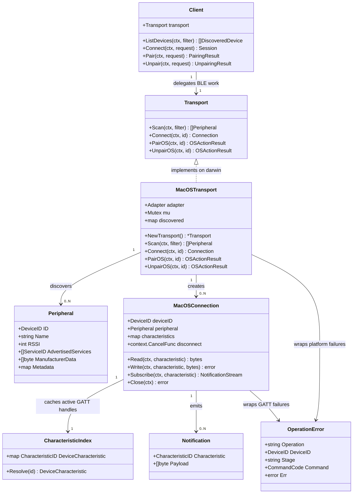

# True MacOS BLE Adapter And Transport

## Requirements

Implement a real MacOS BLE adapter for TimeFlip2 devices that allows consuming Go applications and the existing demo CLI to scan for supported devices, connect to a selected peripheral, read and write TimeFlip2 GATT characteristics, receive characteristic notifications through Go channels, and close connections cleanly while preserving the current platform-neutral `timeflip.Transport` and `timeflip.Connection` contracts.

The implementation must target MacOS CoreBluetooth behavior first, keep non-MacOS builds compiling with explicit unsupported behavior, avoid library-owned storage of remembered devices or secrets, and continue returning manual-action results for OS pairing and unpairing where macOS does not expose a direct library-safe operation.

## Entities

## Approach

1. MacOS BLE Backend:
   - Add `tinygo.org/x/bluetooth` as the BLE backend because it provides a Go API over macOS CoreBluetooth for central-role scan, connect, characteristic reads, characteristic writes, and notifications.
   - Implement the real adapter in Darwin-only files under `macos/` using `//go:build darwin` so the CoreBluetooth-backed code is compiled only on MacOS.
   - Keep the public constructor `macos.NewTransport()` and the public `timeflip.Transport` interface unchanged so existing examples and the demo CLI continue to compile and begin using real hardware behavior automatically on MacOS.

2. Cross-Platform Compatibility:
   - Move placeholder unsupported behavior to non-Darwin files using `//go:build !darwin`.
   - Preserve the existing manual-action behavior for `PairOS` and `UnpairOS` on all platforms unless a safe direct OS operation is available through the selected backend.
   - Return `timeflip.ErrUnsupportedOperation` from non-Darwin scan/connect methods and wrap all failures in `timeflip.OperationError` with operation names such as `macos_scan`, `macos_connect`, `macos_read`, `macos_write`, `macos_subscribe`, and `macos_close`.

3. Discovery and Connection Workflow:
   - Enable the default BLE adapter before scanning.
   - Scan for peripherals, map scan results into `timeflip.Peripheral`, and maintain an in-memory discovered-device map only inside the active `MacOSTransport` instance so callers can pass the returned `DeviceID` into `Connect`.
   - Support `ScanFilter.IncludeUnsupported` by returning all discovered peripherals when requested while still allowing `Client.ListDevices` to filter supported TimeFlip2 devices through the existing `timeflip.IsSupportedPeripheral`.
   - On connect, stop active scanning for the selected device, establish a BLE central connection, discover required TimeFlip2 service and standard support services, discover needed characteristics, and return a `timeflip.Connection`.

4. GATT I/O and Notifications:
   - Implement `Read` by resolving the requested `timeflip.CharacteristicID` to the discovered BLE characteristic and returning a defensive copy of the payload.
   - Implement `Write` by resolving the characteristic and writing the caller payload without response only where appropriate for the backend, otherwise using the reliable write mode exposed by the backend.
   - Implement `Subscribe` by enabling notifications on the requested characteristic, forwarding payload copies into a Go channel, and closing the channel when the subscription is cancelled or the connection is closed.
   - Ensure `Close` is idempotent, cancels all active subscriptions, disconnects the BLE peripheral, and unblocks notification goroutines.

5. Verification and Documentation:
   - Add unit tests around MacOS adapter mapping and error behavior using small helper seams where possible, without requiring real BLE hardware in `go test ./...`.
   - Add build-tag coverage tests or package compile checks so Darwin and non-Darwin files do not define conflicting `Transport` symbols.
   - Update README status and examples to describe the real MacOS adapter, macOS Bluetooth permissions, and the fact that OS pairing/unpairing may still require manual action.

## Structure

### Inheritance Relationships

1. `timeflip.Transport` interface defines platform BLE scanning, connection, OS pairing, and OS unpairing behavior.
2. `timeflip.Connection` interface defines active BLE characteristic read, write, subscribe, and close behavior.
3. `macos.Transport` implements `timeflip.Transport` on Darwin with a CoreBluetooth-backed adapter and implements explicit unsupported behavior on non-Darwin builds.
4. `macos.connection` or `macos.Connection` implements `timeflip.Connection` for one active connected peripheral.
5. `timeflip.OperationError` continues to implement Go `error` and wrap sentinel errors for `errors.Is` compatibility.

### Dependencies

1. `macos` package depends on `github.com/mitchellrj/timeflip-go` for public types and on `tinygo.org/x/bluetooth` for Darwin BLE operations.
2. Root `timeflip` package does not import `macos` and remains platform-neutral.
3. `cmd/timeflip-demo` and `examples/*` continue to depend on `macos.NewTransport()` exactly as they do today.
4. `macos.Transport.Scan` calls the BLE adapter and returns platform-neutral `timeflip.Peripheral` values.
5. `macos.Transport.Connect` calls the BLE adapter, discovers services/characteristics, and returns a platform-neutral `timeflip.Connection`.
6. `macos.Connection` calls backend GATT methods and returns platform-neutral payloads, notifications, and contextual errors.

### Layered Architecture

1. Public API Layer: existing `Client`, `Session`, request/result types, events, and errors remain unchanged.
2. Transport Adapter Layer: `macos.Transport` owns BLE adapter initialization, scan lifecycle, discovered peripheral lookup, and connection creation.
3. Connection Layer: `macos.Connection` owns a connected peripheral, discovered characteristics, subscriptions, close lifecycle, and GATT I/O.
4. Protocol Layer: existing TimeFlip2 UUID constants and decoders remain in `protocol.go` and `internal/protocol`; no protocol parsing moves into `macos`.
5. Test and Documentation Layer: tests cover mapping, unsupported paths, lifecycle behavior, and documentation covers hardware permissions and manual OS pairing limitations.

## Operations

### Update Dependency Definition - Go BLE Backend

1. Responsibility: Add the MacOS-capable BLE backend dependency without changing the public module path, while allowing the Go directive to advance to the minimum required by the selected BLE backend and the locally installed Go toolchain.
2. Files:
   - `go.mod`
   - `go.sum`
3. Logic:
   - Add the current compatible `tinygo.org/x/bluetooth` release as a module dependency.
   - Preserve `module github.com/mitchellrj/timeflip-go`.
   - Set the Go directive to the minimum version required by the selected BLE backend; the local development machine has Go 1.26.3 available.
   - Avoid adding unrelated Bluetooth, logging, configuration, persistence, or CLI dependencies.
4. Completion Criteria:
   - `go test ./...` resolves dependencies and compiles the whole repository.
   - Non-Darwin builds do not attempt to compile CoreBluetooth-specific code.

### Split MacOS Transport By Build Tag - Darwin And Non-Darwin

1. Responsibility: Replace the single placeholder file with build-specific implementations that preserve the same package and constructor.
2. Files:
   - `macos/transport_darwin.go`
   - `macos/transport_unsupported.go`
   - remove or reduce `macos/transport.go` so it does not conflict with build-specific `Transport` definitions.
3. Methods:
   - `func NewTransport() *Transport`
     - Darwin logic: initialize a `Transport` with the default BLE adapter, an empty discovered-device map, and no active scan.
     - Non-Darwin logic: return a `Transport` that reports unsupported scan/connect behavior and manual pairing/unpairing actions.
   - `func unsupportedOSAction(kind timeflip.ManualActionKind, id timeflip.DeviceID, description string) (timeflip.OSActionResult, error)`
     - Keep the existing result shape and `ErrUnsupportedOperation` behavior.
4. Constraints:
   - `github.com/mitchellrj/timeflip-go/macos` must remain importable from existing examples on all developer platforms.
   - Public function names must not change.

### Implement Darwin Transport State - macos.Transport

1. Responsibility: Hold the BLE adapter and active discovery information needed to connect to a peripheral returned by `Scan`.
2. Attributes:
   - `adapter *bluetooth.Adapter`: backend adapter, normally `bluetooth.DefaultAdapter`.
   - `mu sync.Mutex`: protects discovered devices and scan state.
   - `discovered map[timeflip.DeviceID]bluetooth.ScanResult`: latest scan result by stable device ID.
   - `scanning bool`: records whether a scan is in progress to avoid overlapping scan calls.
3. Methods:
   - `func (t *Transport) ensureAdapter(ctx context.Context) error`
     - Enable the adapter.
     - Respect caller context by returning promptly if cancelled before enable completes.
     - Wrap backend failures as `OperationError{Operation: "macos_adapter", Err: ...}`.
   - `func (t *Transport) remember(result bluetooth.ScanResult) timeflip.Peripheral`
     - Convert backend address/name/RSSI/service/manufacturer fields into `timeflip.Peripheral`.
     - Store the scan result by `DeviceID`.
     - Return a defensive, platform-neutral value.
   - `func (t *Transport) AdvertisedName(ctx context.Context, id timeflip.DeviceID) (string, bool)`
     - Return the latest advertised/local name for the device by trying a fresh scan when possible.
     - Fall back to the active-process discovered scan result when macOS cannot rediscover a connected peripheral during a fresh scan.
4. Completion Criteria:
   - State is scoped to the `Transport` instance and does not persist across process restarts.
   - Concurrent calls cannot corrupt the discovered map.

### Implement Scanning - Transport.Scan

1. Interface Definition:
   - `func (t *Transport) Scan(ctx context.Context, filter timeflip.ScanFilter) ([]timeflip.Peripheral, error)`
2. Core Logic:
   - Validate and enable the adapter.
   - Start BLE scanning with the backend adapter.
   - Collect scan results until the caller context is cancelled or times out through the existing client timeout.
   - For each scan result, call `remember`, then append supported devices or all devices depending on `filter.IncludeUnsupported`.
   - Stop scanning before returning.
   - Return collected peripherals and nil error when the context deadline is the normal end of scan and at least zero results were collected.
3. Error Handling:
   - Return `OperationError{Operation: "macos_scan", Err: timeflip.ErrTimeout}` when the scan cannot start or is interrupted by an unexpected backend failure after context wrapping.
   - Return context cancellation errors as wrapped operation errors so `timeflip.IsTimeout` works for deadlines.
4. Completion Criteria:
   - The existing `Client.ListDevices` path returns real BLE devices on MacOS.
   - Include-unsupported behavior is preserved.
   - Scan lifecycle does not leave the adapter scanning after return.

### Implement Connection Establishment - Transport.Connect

1. Interface Definition:
   - `func (t *Transport) Connect(ctx context.Context, id timeflip.DeviceID) (timeflip.Connection, error)`
2. Core Logic:
   - Reject an empty device ID with `ErrInvalidInput`.
   - Look up the selected device in the discovered map.
   - If the device is not known, run a short targeted scan within the provided context to find a peripheral whose backend address or local name maps to the requested ID.
   - Connect to the backend peripheral.
   - Do not reject an explicit connect request solely because scan-time support heuristics fail; renamed TimeFlip devices may advertise a custom name and no service UUID.
   - Use GATT discovery of the required TimeFlip2 service and characteristics as the authoritative support check.
   - Discover the TimeFlip2 service, generic access service, device information service, and battery service where available.
   - Discover and index every characteristic returned by `timeflip.RequiredCharacteristics()` plus standard characteristics used by `ReadDeviceInfo` and `ReadBattery`.
   - Return a `macos.Connection` with a populated characteristic index.
3. Error Handling:
   - Missing known device: use a contextual not-found backend error.
   - Missing required TimeFlip2 service or characteristic: `OperationError{Operation: "macos_connect", DeviceID: id, Err: timeflip.ErrProtocol}`.
   - Context deadline: wrap as `ErrTimeout`.
4. Completion Criteria:
   - `Client.Connect` can open a `Session` against a real TimeFlip2 device discovered by `Client.ListDevices`.
   - The returned connection supports every characteristic the existing `Session` methods use.

### Implement Characteristic Indexing - GATT Mapping

1. Responsibility: Resolve platform-neutral UUID strings to backend characteristic handles for fast read/write/subscribe calls.
2. Attributes:
   - `characteristics map[timeflip.CharacteristicID]bluetooth.DeviceCharacteristic`
   - `services map[timeflip.ServiceID]bluetooth.DeviceService`
3. Methods:
   - `func normalizeUUID(id string) string`
     - Convert short UUIDs such as `0x2A19` and full TimeFlip UUIDs into a canonical uppercase string format used by map keys.
   - `func characteristicID(uuid bluetooth.UUID) timeflip.CharacteristicID`
     - Convert backend UUID values to the canonical `timeflip.CharacteristicID`.
   - `func (c *Connection) resolve(ch timeflip.CharacteristicID) (bluetooth.DeviceCharacteristic, error)`
     - Return the backend characteristic if found.
     - Return `OperationError{Operation: "macos_characteristic", DeviceID: c.deviceID, Err: timeflip.ErrProtocol}` when missing.
4. Completion Criteria:
   - All UUID comparison is case-insensitive and handles both Bluetooth SIG short UUIDs and TimeFlip full UUIDs.
   - Reads, writes, and subscriptions do not rediscover services on every operation.

### Implement Active Connection - macos.Connection

1. Responsibility: Provide GATT operations for one connected TimeFlip2 peripheral.
2. Attributes:
   - `deviceID timeflip.DeviceID`
   - `peripheral bluetooth.Device`
   - `characteristics map[timeflip.CharacteristicID]bluetooth.DeviceCharacteristic`
   - `mu sync.Mutex`
   - `closed bool`
   - `closeOnce sync.Once`
   - `subscriptions map[timeflip.CharacteristicID]context.CancelFunc`
3. Methods:
   - `func (c *Connection) Read(ctx context.Context, ch timeflip.CharacteristicID) ([]byte, error)`
     - Resolve the characteristic.
     - Execute backend read.
     - Return a defensive copy.
     - Map errors to `OperationError{Operation: "macos_read", DeviceID: c.deviceID, Err: ...}`.
   - `func (c *Connection) Write(ctx context.Context, ch timeflip.CharacteristicID, payload []byte) error`
     - Resolve the characteristic.
     - Copy the payload before passing it to backend code.
     - Execute backend write.
     - Map errors to `OperationError{Operation: "macos_write", DeviceID: c.deviceID, Err: ...}`.
   - `func (c *Connection) Subscribe(ctx context.Context, ch timeflip.CharacteristicID) (<-chan timeflip.Notification, error)`
     - Resolve the characteristic.
     - Create an output channel with a small fixed buffer.
     - Enable backend notifications.
     - Forward each backend notification as `timeflip.Notification{Characteristic: ch, Payload: copiedPayload}`.
     - Stop and close the channel on context cancellation, backend unsubscribe, or connection close.
   - `func (c *Connection) Close(ctx context.Context) error`
     - Cancel active subscriptions.
     - Disconnect the peripheral.
     - Mark the connection closed exactly once.
4. Completion Criteria:
   - Existing `Session.ReadDeviceInfo`, `ReadBattery`, `Authorize`, `SendCommand`, `ReadHistory`, and `Events` methods can operate over this connection.
   - `Close` can be called multiple times without panic.
   - Payload slices returned or sent through channels cannot be mutated by backend reuse.

### Preserve OS Pairing And Unpairing Semantics

1. Responsibility: Keep staged pairing/unpairing behavior honest about macOS capabilities.
2. Methods:
   - `func (t *Transport) PairOS(ctx context.Context, id timeflip.DeviceID) (timeflip.OSActionResult, error)`
     - Return a manual action explaining that macOS may prompt for Bluetooth/pairing during connect, authorization, read, or write operations.
     - Preserve `Unsupported: true` and `ErrUnsupportedOperation`.
   - `func (t *Transport) UnpairOS(ctx context.Context, id timeflip.DeviceID) (timeflip.OSActionResult, error)`
     - Return a manual action explaining how to remove the device in macOS Bluetooth settings.
     - Preserve `Unsupported: true` and `ErrUnsupportedOperation`.
3. Completion Criteria:
   - `Client.Pair` and `Client.Unpair` staged results continue to surface manual actions instead of silently claiming OS-level pairing or unpairing was performed.
   - Direct BLE connect/read/write behavior is real even when direct OS pair/unpair operations remain unsupported.

### Add Tests - Adapter Mapping And Unsupported Behavior

1. Responsibility: Verify non-hardware behavior in ordinary CI and local test runs.
2. Files:
   - `macos/transport_unsupported_test.go`
   - `macos/uuid_test.go`
   - `macos/connection_test.go` where helper seams allow backend-free testing.
3. Test Cases:
   - Non-Darwin `Scan` returns `ErrUnsupportedOperation` wrapped in `OperationError`.
   - Non-Darwin `Connect` returns `ErrUnsupportedOperation` wrapped in `OperationError`.
   - `PairOS` returns `ManualActionOSPair` with the requested device ID.
   - `UnpairOS` returns `ManualActionOSUnpair` with the requested device ID.
   - UUID normalization maps lowercase, uppercase, short UUIDs, and full UUID strings consistently.
   - Missing characteristic resolution returns `ErrProtocol` wrapped in a contextual operation error.
   - `Close` is idempotent for a connection constructed with test doubles or internal helper seams.
4. Completion Criteria:
   - Tests do not require Bluetooth hardware.
   - Tests pass with `go test ./...` on the development machine.

### Update Documentation And Demo Notes

1. Responsibility: Reflect that the MacOS adapter is now real for BLE scan/connect/GATT operations while OS pair/unpair remain manual.
2. Files:
   - `README.md`
   - `docs/README.md` if it contains status notes
   - `examples/basic/main.go` only if comments need clarification
   - `examples/pairing/main.go` only if manual action text needs clarification
3. Content:
   - State that MacOS is the first concrete BLE transport.
   - Mention macOS Bluetooth permission prompts and System Settings requirements.
   - Explain that the adapter uses the current process memory only for discovered peripheral lookup and does not persist device IDs or credentials.
   - Explain that pairing prompts may be triggered by macOS during protected GATT operations and that OS unpairing remains a manual System Settings action.
4. Completion Criteria:
   - README no longer says scan/connect are unsupported placeholders on MacOS.
   - Demo instructions remain accurate for real hardware smoke testing.

## Norms

1. Build Tags:
   - Darwin-specific BLE implementation files must use `//go:build darwin`.
   - Unsupported fallback files must use `//go:build !darwin`.
   - Shared helper files may omit build tags only when they do not import platform-specific backend packages.

2. Public API Stability:
   - Do not change `timeflip.Transport`, `timeflip.Connection`, `timeflip.Client`, `timeflip.Session`, request/result structs, or existing examples unless documentation-only clarifications are needed.
   - Keep `macos.NewTransport()` as the way examples and the demo obtain the platform adapter.

3. Error Handling:
   - Wrap platform and backend failures in `timeflip.OperationError`.
   - Preserve sentinel compatibility with `ErrInvalidInput`, `ErrUnsupportedOperation`, `ErrUnsupportedDevice`, `ErrProtocol`, `ErrTimeout`, and `ErrDisconnected`.
   - Convert `context.DeadlineExceeded` to `ErrTimeout` where matching existing `wrapContextErr` behavior is expected by callers.

4. Concurrency:
   - Protect shared transport discovery state with `sync.Mutex`.
   - Make connection close idempotent with `sync.Once`.
   - Never send mutable backend-owned payload slices directly to callers.
   - Ensure notification goroutines terminate on context cancellation or connection close.

5. Statelessness:
   - Do not add files, keychain entries, caches, databases, or package-level maps for remembered devices, passwords, task labels, or history.
   - Instance-local discovered peripheral lookup is allowed only to connect to devices found during the current process lifetime.

6. Documentation:
   - Keep comments concise and focused on exported symbols, build-tag behavior, and non-obvious lifecycle logic.
   - Do not document TimeFlip task interpretation or business workflow behavior in the BLE adapter.

## Safeguards

1. Functional Constraints:
   - MacOS scan, connect, read, write, subscribe, and close must be implemented against real BLE APIs.
   - Non-Darwin scan/connect must remain explicit unsupported operations.
   - OS pair/unpair must not claim direct success unless the backend truly performs those OS-level operations.

2. Compatibility Constraints:
   - `go test ./...` must continue to pass without BLE hardware.
   - Existing imports of `github.com/mitchellrj/timeflip-go/macos` must remain valid.
   - Existing fake transport tests must not be rewritten to depend on MacOS hardware behavior.

3. Security Constraints:
   - Do not persist passwords, device IDs, characteristic payloads, or authorization state outside active objects.
   - Do not log BLE payloads or credentials by default.
   - Manual action descriptions must not expose internal backend errors as user instructions.

4. Performance Constraints:
   - Scan must stop when the provided context ends.
   - Connect must discover required services and characteristics once per connection, not before every read/write.
   - Notification forwarding must use bounded channels and must not spawn unbounded goroutines.

5. Integration Constraints:
   - The root package must remain independent of `tinygo.org/x/bluetooth`.
   - The MacOS backend must be isolated to the `macos` package.
   - The implementation must handle Bluetooth SIG short UUIDs and full TimeFlip UUIDs consistently.

6. Data Constraints:
   - All payloads returned from `Read` and `Subscribe` must be copied before leaving the adapter.
   - `DeviceID` values must be stable enough for the current process to connect to a scanned peripheral.
   - `Peripheral.Metadata` may include backend address or identifier values, but must not be required for normal client operations.

7. API Constraints:
   - No new caller-facing transport methods are allowed for this feature.
   - No MacOS-specific types may appear in the root `timeflip` package.
   - All BLE operations must accept and respect `context.Context`.

8. Test Constraints:
   - Unit tests must avoid requiring real Bluetooth hardware.
   - Hardware smoke testing may be documented separately but must not be required by default CI.
   - Tests must cover unsupported fallback behavior and helper logic that can be exercised without CoreBluetooth.
