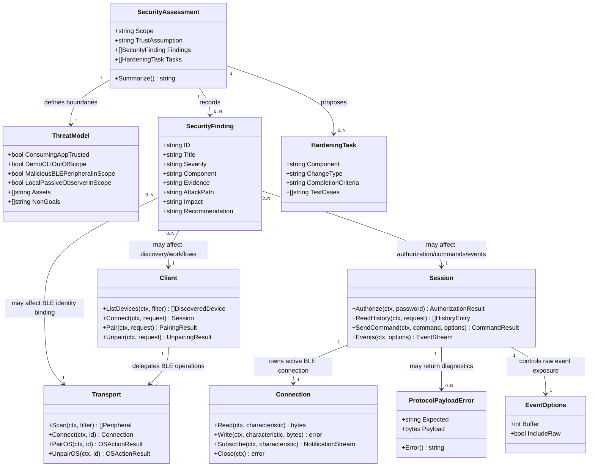

# TimeFlip Go Library Security Red-Team Analysis

## Requirements

Analyse the TimeFlip2 Go library for security weaknesses from a red-team perspective while assuming the consuming application and its callers are trusted. Focus on risks created by malicious or spoofed BLE peripherals, local Bluetooth behavior, protocol ambiguity, diagnostic data exposure, resource exhaustion, and unsafe defaults in the library API. Exclude the demo CLI application and example applications from assessment and implementation scope.

The outcome must be an actionable security assessment and hardening backlog for the reusable library, preserving the library's stateless design, existing transport abstraction, context-aware operation model, and backwards-compatible public API wherever possible.

## Entities

## Approach

1. Threat Model and Scope:
   - Treat the consuming application as trusted, so malicious public API callers, hostile persistence layers, and deliberate misuse by the host application are out of scope.
   - Treat nearby BLE devices and Bluetooth advertisements as untrusted because an attacker can spoof names, services, manufacturer data, command responses, history packets, and notifications.
   - Exclude `cmd/timeflip-demo/**` and `examples/**` from findings, except where README or public API behavior inherited from the reusable library creates integrator-facing risk.
   - Protect assets including TimeFlip password bytes, device identity binding, command integrity, history/event confidentiality, process memory/resource availability, and diagnostic safety.

2. Codebase Review Strategy:
   - Review the root package files `client.go`, `session.go`, `protocol.go`, `types.go`, `options.go`, and `errors.go` for API-level security posture.
   - Review `internal/protocol/*.go` for parser validation, length checks, and command encoding boundaries.
   - Review `macos/transport_darwin.go` and `macos/connection_darwin.go` for BLE identity binding, scan/connect behavior, notification handling, cancellation, and local resource behavior.
   - Use existing tests in `client_test.go`, `session_test.go`, `protocol_test.go`, and `macos/*_test.go` as evidence for current assumptions and as locations for targeted regression tests.

3. Finding Prioritization:
   - Prioritize exploitable behavior by a malicious BLE peripheral over purely theoretical risks.
   - Rank as high when behavior can cause unauthorized command acceptance, wrong-device connection, password exposure, or destructive operations against an unintended device.
   - Rank as medium when behavior can cause persistent denial of service, confusing trusted applications into unsafe decisions, or leak sensitive device data through normal logs.
   - Rank as low when behavior is mostly documentation, default posture, or defense-in-depth with limited exploitability under the trusted-application assumption.

4. Hardening Philosophy:
   - Preserve compatibility by adding stricter options, safer defaults for new behavior, redaction helpers, or additional validation rather than removing existing APIs.
   - Keep the library stateless and avoid adding persistent device registries, password stores, or authorization caches.
   - Keep security controls in library and transport layers; do not rely on the demo CLI.
   - Validate all mitigation with focused unit tests and transport tests that simulate malicious peripheral behavior.

## Structure

### Inheritance Relationships

1. `Transport` interface defines the BLE boundary where untrusted device discovery and connection metadata enter the library.
2. `Connection` interface defines characteristic read, write, subscribe, and close behavior for untrusted GATT payloads.
3. `Client` coordinates trusted caller intent with untrusted transport results and creates `Session` instances.
4. `Session` owns one active `Connection` and performs password authorization, commands, reads, history parsing, and event streaming.
5. `ProtocolPayloadError` implements `error` and exposes malformed protocol bytes for diagnostics.
6. Security assessment artifacts are markdown/report entities, not runtime library entities, unless a hardening task explicitly requires a small API addition.

### Dependencies

1. `Client.ListDevices` depends on `Transport.Scan` and `IsSupportedPeripheral` for support detection.
2. `macos.Transport.Connect` depends on remembered scan results and may scan again before connecting.
3. `Session.Authorize` depends on password writes to `charPassword` and command-result reads from `charCommandResult`.
4. `Session.ReadHistory`, `readCommandStatusFor`, and `readCommandOutputFor` depend on repeated reads from untrusted characteristics until completion or timeout.
5. `Session.Events` depends on transport subscriptions and decoders for notification payloads.
6. Error formatting depends on `OperationError` and `ProtocolPayloadError`, which may include operation, device ID, command, and raw bytes.

### Layered Architecture

1. Assessment Layer: threat model, findings, severity, evidence, exploit path, impact, and recommended mitigation.
2. Public API Layer: trusted caller contracts, configuration options, request/result types, error values, and documentation-facing defaults.
3. Workflow Layer: pairing, unpairing, authorization, verification, command send/read, history streaming, and event streaming.
4. Protocol Layer: payload length validation, command encoding, command acknowledgement parsing, history parsing, and text event parsing.
5. Transport Layer: macOS adapter discovery, identity matching, service/characteristic validation, read/write/subscribe behavior, and cancellation.
6. Test Layer: fake transport/connection and macOS unit tests that model malicious advertisements, malformed payloads, stale authorization results, and timeout/resource pressure.

## Operations

### Create Assessment Document - Library Security Findings

1. Responsibility: Produce a red-team security assessment document for the reusable library.
2. Location:
   - Create `spdd/analysis/GGQPA-XXX-202605242209-[Analysis]-library-security-red-team.md`.
3. Required Sections:
   - Scope and assumptions: trusted consuming app, demo CLI out of scope, malicious BLE peripherals in scope.
   - Assets: password bytes, device identity, command intent, history/events, diagnostics, process availability.
   - Attack surface: scan/list, connect, authorize, pair/unpair, command send/read, history, events, macOS transport, errors.
   - Findings table with severity, component, evidence, attack path, impact, recommendation, and tests.
   - Non-findings and accepted risks where the trusted-application assumption makes an issue non-exploitable.
4. Finding IDs and Minimum Findings:
   - `SEC-001`: permissive device support detection based on advertised name/model can be spoofed.
   - `SEC-002`: macOS `Connect` fallback accepts peripheral name as a device identifier when an ID was not remembered.
   - `SEC-003`: authorization currently treats empty, unknown, or read-error command-result payloads as success in several cases.
   - `SEC-004`: default password fallback is convenient but can normalize weak pairing flows unless documentation and result metadata make the risk explicit.
   - `SEC-005`: `ProtocolPayloadError.Error()` includes raw bytes, which may leak history/event/device data into trusted-app logs.
   - `SEC-006`: `Events` can expose raw bytes from the TimeFlip events characteristic even when `EventOptions.IncludeRaw` is false.
   - `SEC-007`: history and command output read loops are timeout-bounded but do not have explicit packet/iteration budgets.
   - `SEC-008`: password strings are copied through immutable Go strings and byte slices with no explicit zeroization path.
5. Completion Criteria:
   - Each finding includes file/function evidence and an actionable mitigation.
   - Findings distinguish exploitable weakness, accepted risk, and defense-in-depth.
   - The document does not analyze `cmd/timeflip-demo/**` or `examples/**`.

### Add Tests - Device Identity and Discovery Spoofing

1. Responsibility: Capture current and desired behavior for spoofed BLE advertisements and wrong-device connection risk.
2. Files:
   - Update `protocol_test.go` for `IsSupportedPeripheral`.
   - Update `macos/transport_darwin_test.go` or add focused fakeable tests around matching logic if direct CoreBluetooth testing is impractical.
3. Methods:
   - Add test case showing that a peripheral with only `Name: "TIMEFLIP2"` is treated as supported today and document this as heuristic support rather than authenticated identity.
   - Extract macOS connect candidate matching into a small helper such as `matchesConnectCandidate(peripheral timeflip.Peripheral, requestedID timeflip.DeviceID, allowNameFallback bool) bool` if needed for testability.
   - Add tests where two peripherals share a TimeFlip-like name and only one has the requested address; desired strict behavior must prefer exact address and avoid name-only connection unless explicitly allowed.
4. Constraints:
   - Do not remove name fallback without either an explicit compatibility option or a documented staged deprecation.
   - Do not add persistent known-device storage.
5. Completion Criteria:
   - Tests prove the spoofing risk and define a safer path for strict identity matching.

### Harden Authorization Semantics - Fail Closed on Ambiguous Results

1. Responsibility: Prevent malicious or malformed command-result behavior from being interpreted as successful authorization.
2. Files:
   - Update `session.go`.
   - Update `session_test.go`.
3. Methods:
   - Modify `readAuthorizationResult(ctx)` so explicit success payload `0x02` returns `Authorized: true`.
   - Treat explicit wrong password payload `0x01` as authorization failure after the existing short stale-result window unless followed by fresh success.
   - Treat malformed non-empty payloads as `ErrProtocol`, not success.
   - Treat read errors as success only if a documented device behavior proves that no result is expected; otherwise return a wrapped read error or timeout.
   - Add tests for empty payload, malformed payload, read error, stale wrong followed by success, and persistent wrong result.
4. Constraints:
   - Preserve `Authorize(ctx, "")` using `DefaultPassword`.
   - Preserve context timeout behavior and `ErrAuthorizationFailed` compatibility.
5. Completion Criteria:
   - Ambiguous authorization no longer succeeds silently.
   - Tests cover all observed branches in `readAuthorizationResult`.

### Add Diagnostic Redaction Controls - ProtocolPayloadError and Raw Events

1. Responsibility: Reduce accidental leakage of raw BLE payloads into logs while preserving opt-in diagnostics for trusted applications.
2. Files:
   - Update `errors.go`.
   - Update `session.go`.
   - Update `session_test.go`.
   - Update README security notes if behavior changes are user-visible.
3. Methods:
   - Keep `ProtocolPayloadError.Payload` available for programmatic inspection by trusted callers.
   - Change `ProtocolPayloadError.Error()` to include payload length and a short redacted preview, or add a redacted `Error()` plus explicit `RawPayloadHex()` helper.
   - Ensure password bytes are never included in protocol payload errors.
   - Adjust `decodeNotification` so `Event.Raw` is populated only when `EventOptions.IncludeRaw` is true, except where raw bytes are the intentional payload of `EventRaw`.
   - Add tests showing default error strings do not include full raw payloads and IncludeRaw gates typed event raw fields.
4. Constraints:
   - Do not remove raw payload fields from structs because trusted applications may depend on them.
   - Keep diagnostics useful enough for hardware troubleshooting.
5. Completion Criteria:
   - Normal `err.Error()` output no longer dumps complete raw BLE data.
   - Raw event bytes are opt-in for typed events.

### Bound Untrusted Read Loops - History and Command Output Budgets

1. Responsibility: Add explicit iteration or packet budgets to loops that read until a peripheral-produced terminator or timeout.
2. Files:
   - Update `session.go`.
   - Update `options.go` only if a public configurable budget is justified.
   - Update `session_test.go`.
3. Methods:
   - Add internal constants for maximum command status polls, command output polls, and v3 history packets within one operation.
   - Return `ErrProtocol` or `ErrTimeout` with clear operation context when a budget is exceeded.
   - Keep context timeout as the outer bound.
   - Add tests where a fake connection returns endless mismatched acknowledgements, endless mismatched command outputs, and endless non-terminal v3 history packets.
4. Constraints:
   - Choose budgets high enough for real TimeFlip2 behavior and documented packet sizes.
   - Do not introduce unbounded goroutines or background timers.
5. Completion Criteria:
   - Malicious peripherals cannot force arbitrary memory growth or excessive loop counts within a long caller timeout.

### Clarify Password Handling and Defaults - Documentation and API Metadata

1. Responsibility: Make password security properties explicit without pretending BLE password authorization is cryptographic authentication.
2. Files:
   - Update README library sections.
   - Consider adding fields to `AuthorizationResult` and `PairingResult` only if backwards compatible and valuable.
3. Methods:
   - Document that the TimeFlip password is sent as six bytes to the device password characteristic and should be treated as sensitive in traces/logs.
   - Document that an empty password uses factory default `000000` and should be used only for new/reset devices or explicit caller intent.
   - If adding metadata, add `UsedDefaultPassword bool` to result types where practical without breaking callers.
   - Do not log, persist, or retain passwords in the library.
4. Constraints:
   - Do not require consuming applications to be untrusted; this is guidance for trusted app operators and integrators.
   - Do not introduce password storage.
5. Completion Criteria:
   - README communicates default-password and plaintext-byte limitations clearly.
   - Any new metadata has tests and preserves existing API behavior.

### Run Verification - Security-Focused Regression Suite

1. Responsibility: Verify that assessment and hardening changes are covered.
2. Commands:
   - `go test ./...`
3. Additional Checks:
   - Search for raw payload formatting with `rg -n "raw=0x|Payload|IncludeRaw|DefaultPassword|password"`.
   - Confirm no behavior changes were made under `cmd/timeflip-demo/**` or `examples/**`. Test fixture updates under `cmd/timeflip-demo/**` are allowed only when required to represent the hardened library contract, such as returning explicit authorization success bytes instead of ambiguous default payloads.
4. Completion Criteria:
   - All tests pass.
   - Security assessment document exists and references concrete file/function evidence.
   - New tests fail on the previously vulnerable behavior and pass with the mitigation.

## Norms

1. Scope Discipline: Treat the reusable library as in scope and the demo CLI plus examples as out of scope.
2. Trust Model: Do not model the consuming application as malicious; do model BLE advertisements, GATT payloads, and notifications as untrusted.
3. Backwards Compatibility: Prefer additive options, stricter internal validation, and documented deprecations over breaking public API changes.
4. Error Handling:
   - Preserve sentinel errors such as `ErrInvalidInput`, `ErrAuthorizationFailed`, `ErrProtocol`, `ErrTimeout`, and `ErrDisconnected`.
   - Wrap operation context with `OperationError`.
   - Avoid full raw payload dumps in default error strings.
5. Validation:
   - Validate payload length before indexing.
   - Treat ambiguous security-sensitive protocol data as failure unless hardware behavior requires a documented exception.
   - Bound loops that depend on remote terminators.
6. Data Handling:
   - Clone slices and maps at API boundaries as existing code does.
   - Do not persist passwords, device IDs, payloads, authorization state, or history.
   - Keep raw bytes opt-in where possible.
7. Testing:
   - Use fake transports/connections for deterministic malicious peripheral scenarios.
   - Add focused table tests for edge cases rather than broad fixture rewrites.
   - Keep macOS-specific behavior behind helpers where direct CoreBluetooth tests would be brittle.
8. Documentation:
   - Document accepted risks plainly, especially spoofable BLE identity and plaintext password writes.
   - Avoid overstating security guarantees that BLE/device protocol cannot provide.

## Safeguards

1. Functional Constraints: The public library must continue to scan, connect, authorize, pair, unpair, read device data, send commands, stream events, and close sessions.
2. Scope Constraints: Do not assess or edit demo CLI behavior under `cmd/timeflip-demo/**`; do not assess or edit example applications under `examples/**`. Demo test fixtures may be adjusted only to keep verification aligned with hardened library contracts and must not change application behavior.
3. Security Constraints:
   - Malformed or ambiguous authorization responses must not silently grant authorization.
   - Device identity matching must distinguish heuristic support detection from authenticated identity.
   - Raw payloads must not be dumped wholesale by default error strings.
   - Password bytes must not appear in diagnostic errors.
4. Performance Constraints:
   - Existing default communication timeout remains 10 seconds unless explicitly changed.
   - Added loop budgets must not block legitimate TimeFlip2 history and command flows.
   - Event delivery must avoid unbounded buffering.
5. Integration Constraints:
   - Preserve `Transport` and `Connection` interface shapes unless a security fix cannot be implemented otherwise.
   - Preserve existing sentinel errors and `errors.Is`/`errors.As` behavior.
   - Do not add cloud, mobile app, persistent storage, or external security service dependencies.
6. Data Constraints:
   - Public structs that intentionally expose raw bytes may remain, but default string formatting should redact.
   - New metadata fields must be backwards compatible.
   - Password inputs remain six bytes because the device protocol requires six-byte authorization.
7. Technical Constraints:
   - Keep code idiomatic Go and compatible with the current `go.mod`.
   - Use existing package boundaries: root package for API/workflow, `internal/protocol` for protocol parsing, `macos` for CoreBluetooth transport.
   - Prefer table-driven tests.
8. Verification Constraints:
   - `go test ./...` must pass.
   - Findings must cite concrete files/functions.
   - Any accepted risk must include rationale tied to the trusted consuming-application assumption.
