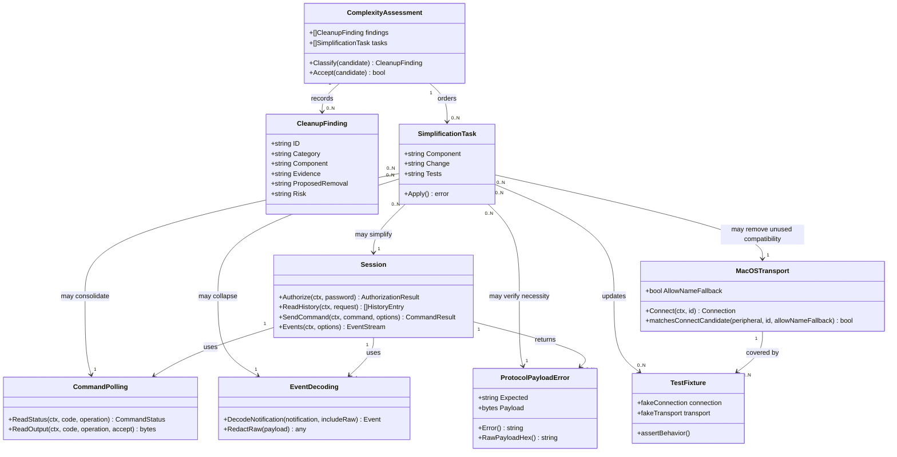

# TimeFlip Go Library Complexity Cleanup

## Requirements

Assess the TimeFlip2 Go library for duplication, unused complexity, and premature optimization, then remove the confirmed waste while preserving public behavior, security hardening, transport abstractions, and test coverage.

Focus on simplifying the reusable library and its tests after the recent security hardening work. Do not rewrite architecture, remove necessary defensive checks, weaken security posture, or change demo/example application behavior. Any removal must be justified by evidence that the code is duplicated, unused, unnecessarily configurable, or more complex than the behavior requires.

## Entities

## Approach

1. Evidence-First Cleanup:
   - Search for duplication, unused symbols, unnecessary exported fields, test-only production mutability, and control-flow complexity introduced by recent hardening.
   - Classify each candidate as duplication, unused complexity, premature optimization, or necessary defensive behavior.
   - Remove only candidates with clear evidence and preserve candidates that protect against malicious BLE payloads, spoofed identity, raw diagnostic leaks, or unbounded reads.

2. Conservative Refactoring:
   - Prefer small local simplifications over architectural rewrites.
   - Keep `Transport`, `Connection`, public request/result types, sentinel errors, and existing public method signatures stable unless a public surface is demonstrably unused and newly introduced.
   - Consolidate repeated code only when it reduces cognitive load without hiding protocol-specific behavior.
   - Remove test-only production variables or compatibility knobs if tests can be made deterministic through context timeouts, fake connection behavior, or unexported helpers.

3. Candidate Areas:
   - `session.go` command polling: `readCommandStatusFor` and `readCommandOutputFor` have similar budget/timer/error loops.
   - `session.go` event decoding: repeated `if !includeRaw { payload.Raw = nil }` branches and `redactTypedEventRaw`.
   - `session.go` authorization timing: mutable package variables exist largely to speed tests.
   - `macos/transport_darwin.go`: `AllowNameFallback` compatibility field and `matchesConnectCandidate` helper may be unnecessary if name fallback should not remain supported.
   - `errors.go`: `RawPayloadHex()` should remain only if it serves trusted diagnostics and is covered by a test or documented public need.
   - Tests: repeated setup patterns may be simplified only where readability improves and failure messages remain clear.

4. Verification Strategy:
   - Run `go test -count=1 ./...` after simplification.
   - Use `rg` to confirm removed symbols no longer have references.
   - Confirm security behaviors still hold: fail-closed authorization, strict device identity by default, redacted error strings, raw event gating, and bounded loops.
   - Avoid modifying `cmd/timeflip-demo/**` or `examples/**` except test fixtures required to align with library behavior.

## Structure

### Inheritance Relationships

1. `Transport` interface remains the platform BLE boundary and must not gain simplification-specific methods.
2. `Connection` interface remains the active GATT operation boundary and must not gain simplification-specific methods.
3. `Session` remains the owner of authorization, reads, writes, event streams, and command helpers.
4. `ProtocolPayloadError` remains an `error` implementation with `errors.As` support.
5. Test fixtures remain package-local helpers and must not drive new production abstractions.

### Dependencies

1. `Session.Authorize` depends on `authorizationResultWindow` behavior, password writes, and command-result reads.
2. `readCommandPayload` depends on command status and command output polling helpers.
3. `Events` depends on `decodeNotification` and typed protocol decoders.
4. `macos.Transport.Connect` depends on discovered scan results and candidate matching.
5. Tests depend on fake transports/connections and should not require production mutability solely for speed.
6. README and SPDD prompt files document behavior and must remain consistent with any removed public compatibility surface.

### Layered Architecture

1. Assessment Layer: identify candidates, classify them, decide whether to remove, keep, or document.
2. Library Layer: simplify root package code while preserving public contracts.
3. Protocol Layer: preserve payload validation, raw byte cloning, and decoder clarity.
4. Transport Layer: simplify macOS identity matching only if security and compatibility rationale support removal.
5. Test Layer: update focused unit tests to verify behavior, not implementation artifacts.
6. Documentation Layer: update README and SPDD prompt if public behavior or explicit compatibility options change.

## Operations

### Create Cleanup Assessment - Complexity Findings

1. Responsibility: Produce a short assessment of confirmed and rejected cleanup candidates before editing code.
2. Location:
   - Create `spdd/analysis/GGQPA-XXX-202605242222-[Analysis]-library-complexity-cleanup.md`.
3. Methods:
   - Search for candidate complexity with:
     - `rg -n "authorizationResultWindow|authorizationPollInterval|commandPollInterval|AllowNameFallback|redactTypedEventRaw|RawPayloadHex|maxCommandStatusPolls|maxCommandOutputPolls|maxHistoryV3Packets"`
     - `rg -n "append\\(\\[\\]byte\\(nil\\)|if !includeRaw|time.NewTimer|within poll budget"`
   - Inspect `session.go`, `errors.go`, `macos/transport_darwin.go`, and related tests.
   - For each candidate, record evidence, decision, and risk.
4. Required Findings:
   - Assess whether test-only mutable timing variables are premature optimization or necessary testability.
   - Assess whether `AllowNameFallback` is unused compatibility complexity and whether it should be removed.
   - Assess whether event raw redaction can be simplified without changing `IncludeRaw` behavior.
   - Assess whether command polling loops can be consolidated without obscuring different status/output semantics.
   - Assess whether `RawPayloadHex()` is useful enough to remain public.
5. Completion Criteria:
   - The assessment identifies which code will be removed or simplified.
   - Rejected simplifications include rationale.
   - No code is changed before the assessment file exists.

### Remove Test-Only Production Mutability - Authorization and Poll Intervals

1. Responsibility: Remove mutable package variables that exist only to make tests fast if deterministic tests can be written without them.
2. Files:
   - `session.go`
   - `session_test.go`
3. Methods:
   - Convert `authorizationResultWindow`, `authorizationPollInterval`, and `commandPollInterval` back to constants if no production code needs runtime mutation.
   - Update tests that use `withAuthorizationTiming` and `withCommandPollInterval` to use short context deadlines, fake read sequences, or direct helper tests instead.
   - If a timing variable must remain mutable, document the concrete reason in the assessment and keep the narrowest possible variable.
4. Constraints:
   - Wrong-password tests must not become slow or flaky.
   - Authorization must still wait briefly for stale `0x01` followed by fresh `0x02`.
   - Poll-budget tests must still verify budget behavior without waiting seconds.
5. Completion Criteria:
   - No test-only mutable timing helper remains unless justified in the assessment.
   - `go test -count=1 ./...` passes.

### Remove Unused macOS Name-Fallback Compatibility - If Unreferenced

1. Responsibility: Remove `AllowNameFallback` and name-based candidate matching if it is unused and contrary to the security default.
2. Files:
   - `macos/transport_darwin.go`
   - `macos/transport_darwin_test.go`
   - README if it mentions the compatibility option
3. Methods:
   - Search for `AllowNameFallback` references.
   - If only tests and the field declaration reference it, remove the field and simplify `matchesConnectCandidate` to exact `peripheral.ID == requestedID`.
   - Replace compatibility fallback tests with strict matching tests.
   - If external compatibility is intentionally preserved, keep the field and record it as accepted complexity.
4. Constraints:
   - Do not restore name-based matching by default.
   - Do not change `Transport` interface.
   - Do not add persistent device identity storage.
5. Completion Criteria:
   - Either `AllowNameFallback` is removed entirely or its retention is justified in the assessment.
   - macOS transport tests cover strict matching.

### Simplify Event Raw Redaction - Reduce Repeated Branches

1. Responsibility: Remove repeated raw-clearing branches in notification decoding while preserving raw opt-in behavior.
2. Files:
   - `session.go`
   - `session_test.go`
3. Methods:
   - Introduce a small unexported helper only if it replaces real duplication, such as `eventWithPayload(kind, payload, includeRaw)` or typed `withoutRaw` helpers.
   - Prefer direct clarity over generic reflection or broad `any` manipulation.
   - Remove `redactTypedEventRaw` if a simpler construction path can avoid adding raw data in the first place.
   - Ensure `EventRaw` still carries raw payload bytes as its payload because that is the event content.
4. Constraints:
   - Do not remove `Raw` fields from public event payload structs.
   - Do not change `EventOptions.IncludeRaw` semantics.
   - Do not use reflection.
5. Completion Criteria:
   - Event decoding is shorter or clearer.
   - Tests still prove typed event raw omission by default and preservation with `IncludeRaw`.

### Consolidate Command Polling Only Where It Reduces Complexity

1. Responsibility: Evaluate and optionally consolidate duplicated polling loops for command status and command output.
2. Files:
   - `session.go`
   - `session_test.go`
3. Methods:
   - Compare `readCommandStatusFor` and `readCommandOutputFor`.
   - If a shared helper can express characteristic, budget, read acceptance, timeout error, and budget error without generic callback sprawl, introduce it.
   - If consolidation would make protocol-specific behavior less obvious, keep separate loops and record the rejected simplification.
   - Remove duplicated error strings only if behavior stays clear and tests still assert sentinel errors rather than brittle messages.
4. Constraints:
   - Preserve `CommandResult` raw malformed acknowledgement behavior.
   - Preserve password-wrong detection in command output.
   - Preserve context timeout wrapping and poll-budget behavior.
5. Completion Criteria:
   - Either duplication is reduced with clearer code, or it is explicitly accepted as purposeful duplication.

### Review Diagnostic Helper Surface - RawPayloadHex

1. Responsibility: Decide whether `ProtocolPayloadError.RawPayloadHex()` is necessary or an unnecessary public helper.
2. Files:
   - `errors.go`
   - `session_test.go`
   - README
3. Methods:
   - Search for `RawPayloadHex`.
   - If only tests and README reference it, consider removing it and documenting that trusted callers can inspect `Payload` directly.
   - If retaining it, ensure the assessment explains why the explicit helper is simpler or safer than repeated caller formatting.
4. Constraints:
   - `ProtocolPayloadError.Payload` must remain available for `errors.As` diagnostics.
   - Default `Error()` output must remain redacted.
5. Completion Criteria:
   - The public helper is either removed or justified.
   - Tests and README match the decision.

### Remove Redundant Tests Without Losing Behavior Coverage

1. Responsibility: Trim tests that only assert implementation details introduced by the complexity being removed.
2. Files:
   - `session_test.go`
   - `protocol_test.go`
   - `macos/transport_darwin_test.go`
3. Methods:
   - Keep tests that protect externally visible behavior or important security contracts.
   - Combine table-driven cases where setup and assertions are identical.
   - Remove tests whose only purpose was exercising removed compatibility or mutable timing helpers.
4. Constraints:
   - Do not reduce coverage for fail-closed authorization, strict device matching, redacted diagnostics, event raw gating, and read-loop budgets.
   - Keep failure messages clear.
5. Completion Criteria:
   - Test suite is shorter or clearer.
   - Security regression coverage remains explicit.

### Verify Cleanup - Tests and Search Checks

1. Responsibility: Prove cleanup did not change required behavior.
2. Commands:
   - `go test -count=1 ./...`
   - `rg -n "authorizationResultWindow|authorizationPollInterval|commandPollInterval|AllowNameFallback|redactTypedEventRaw|RawPayloadHex" --glob "*.go" --glob "README.md"`
   - `rg -n "raw payload redacted|IncludeRaw|ErrAuthorizationFailed|maxCommandStatusPolls|maxCommandOutputPolls|maxHistoryV3Packets"`
3. Completion Criteria:
   - All tests pass.
   - Removed symbols have no remaining references.
   - Kept symbols have documented rationale in the assessment.
   - No behavior changes are made under `cmd/timeflip-demo/**` or `examples/**`, except fixture-only updates required by library contract.

## Norms

1. Evidence Before Removal: Do not remove code because it looks untidy; remove it only after identifying duplication, unused complexity, or premature optimization.
2. Public API Caution: Preserve existing public APIs unless the surface was newly introduced, unused, and clearly not worth carrying.
3. Security Preservation:
   - Authorization ambiguity must remain fail-closed.
   - macOS connection matching must remain strict by default.
   - Protocol error strings must remain redacted by default.
   - Typed event raw bytes must remain opt-in.
   - Remote-controlled loops must remain bounded.
4. Test Style:
   - Prefer behavior tests over implementation tests.
   - Keep deterministic tests fast without production-only configurability where possible.
   - Use table-driven tests where it clarifies cases.
5. Simplicity Standard:
   - Avoid reflection, generic callback-heavy abstractions, and broad helper types.
   - A little purposeful duplication is acceptable when it keeps protocol behavior obvious.
   - Do not introduce new packages or architecture layers for cleanup.
6. Documentation:
   - Update README only when public behavior or documented helper surfaces change.
   - Update the SPDD prompt first if implementation reality requires changing this plan.

## Safeguards

1. Functional Constraints: The library must continue to scan, connect, authorize, pair, unpair, read data, send commands, stream events, and close sessions.
2. Compatibility Constraints: Do not change `Transport`, `Connection`, `Client`, `Session`, request/result types, or sentinel errors unless the assessment explicitly proves a newly introduced public surface should be removed.
3. Security Constraints:
   - Do not reintroduce authorization success on empty, malformed, or read-error payloads.
   - Do not reintroduce default name-based macOS connection matching.
   - Do not expose raw protocol payloads in default error strings.
   - Do not remove command/history read budgets.
4. Scope Constraints: Do not refactor demo CLI or examples. Demo test fixtures may change only to align with the library contract.
5. Performance Constraints: Do not add slower tests or longer sleeps. Cleanup must not increase normal command/event latency.
6. Data Constraints: Preserve slice/map cloning at API boundaries where callers receive raw bytes or metadata.
7. Technical Constraints: Keep code idiomatic Go, run `gofmt`, and avoid new dependencies.
8. Verification Constraints: `go test -count=1 ./...` must pass and the assessment must document every removed or retained complexity candidate.
