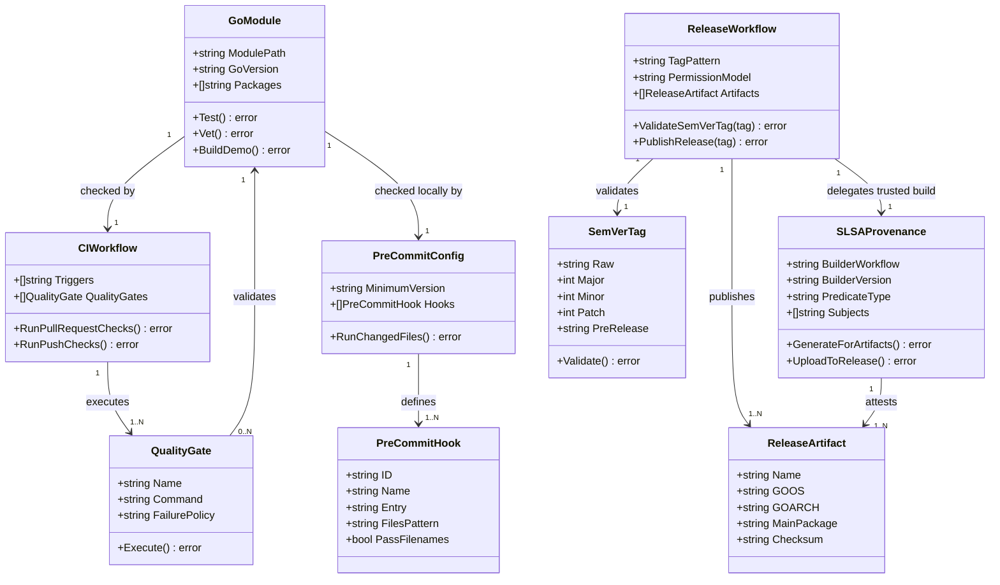

# Go CI, Quality, Release, and Provenance Pipeline

## Requirements

Implement a GitHub Actions and pre-commit quality system for the TimeFlip Go module that tests every change, assesses code quality and dependency risk, publishes semver-tagged releases with verifiable SLSA provenance artifacts, and exposes accurate project health widgets in the README.

The implementation must fit the existing `github.com/mitchellrj/timeflip-go` repository, which currently uses Go `1.23.8`, has no `.github` workflow directory, and has a stale `.pre-commit-config.yaml` copied from a different stack. Keep the library and demo behavior unchanged; this task creates delivery infrastructure only. Releases must be driven by Git tags that follow SemVer with a leading `v`, such as `v1.2.3` or `v1.2.3-rc.1`, and must not publish from arbitrary branches.

## Entities

## Approach

1. Local Quality Baseline:
   - Replace the current drifted `.pre-commit-config.yaml` with Go-specific hooks and retain only generic file hygiene hooks that apply to this repository.
   - Add executable scripts under `scripts/dev/` so pre-commit and GitHub Actions can share the same quality commands without duplicating shell logic.
   - Keep pre-commit fast enough for normal development: formatting, module tidy verification, vet, tests, and a pinned `golangci-lint` hook that matches CI.

2. GitHub Actions CI:
   - Create `.github/workflows/ci.yml` for pull requests and pushes to mainline branches.
   - Use `actions/checkout`, `actions/setup-go` with `go-version-file: go.mod`, and Go module caching.
   - Run quality gates in clear stages: `gofmt` check, `go mod tidy` cleanliness check, `go vet ./...`, `go test -count=1 ./...`, Linux `go test -count=1 -race ./...`, `go test -coverprofile=build/coverage.out ./...`, demo build to a temporary or ignored path, and dependency vulnerability scanning with `govulncheck`.
   - Use least-privilege permissions (`contents: read`) for CI and avoid release permissions outside the release workflow.

3. Static Quality and Security Assessment:
   - Add `.golangci.yml` with conservative linters that should suit this small library: `govet`, `staticcheck`, `ineffassign`, `unused`, `errcheck`, `misspell`, `gofmt`, and `goimports` if available through the selected `golangci-lint` version.
   - Configure CI to run `golangci/golangci-lint-action` with an explicit version compatible with Go 1.23.x.
   - Configure `govulncheck` through `golang/govulncheck-action` so dependency and standard-library vulnerabilities fail CI before release.
   - Add an OpenSSF Scorecard workflow that publishes results for the public Scorecard badge and uploads SARIF to GitHub code scanning.
   - Add Dependabot version update coverage for Go modules, GitHub Actions, and pre-commit hook revisions.

4. SemVer Release Flow:
   - Create `.github/workflows/release.yml` triggered only by tags matching `v*`.
   - Add a first job that validates the pushed tag against a SemVer regex with leading `v`, rejecting malformed tags before any publish step.
   - Publish releases only for validated tags. Stable tags produce normal releases; tags containing a prerelease segment such as `-rc.1` produce prereleases.
   - Build the demo CLI artifact from `./cmd/timeflip-demo`; keep the library itself released through Go module tags and GitHub source archives.

5. SLSA Provenance:
   - Use the official SLSA GitHub Go builder reusable workflow `slsa-framework/slsa-github-generator/.github/workflows/builder_go_slsa3.yml@v2.1.0` for release artifact builds.
   - Reference the SLSA builder by a full semantic tag of the form `@vX.Y.Z`, because SLSA verifier support depends on that format for reusable workflows.
   - Grant the trusted builder only the permissions it needs: `id-token: write`, `contents: write`, and `actions: read`.
   - Add `.slsa-goreleaser/` config files for each supported release target and ensure generated `.intoto.jsonl` provenance artifacts are uploaded to the GitHub Release beside the binaries.
   - Document verification using `slsa-verifier` and the expected source repository, tag, binary subject, and provenance file.

6. Repository Fit:
   - Keep release targets conservative: build `timeflip-demo` for `linux/amd64` and `linux/arm64`, which compile reliably with `CGO_ENABLED=0`.
   - Document that Darwin CLI binaries are not currently published by the SLSA release workflow because the CoreBluetooth dependency requires cgo and cross-platform Darwin builds are not reliable in the trusted builder path.
   - Do not alter public Go APIs, BLE protocol behavior, macOS transport behavior, examples, or tests except where documentation references the new delivery workflow or a CI-blocking race detector finding must be fixed to satisfy the new quality gate.

7. README Widgets:
   - Add accurate badges for CI, Go Report Card, OpenSSF Scorecard, and SLSA provenance level.
   - Use live service badges where the repository has a real backing service.
   - Label SLSA as provenance level 3 rather than broad project compliance.

## Structure

### Inheritance Relationships

1. `CIWorkflow` defines the common quality contract for pull requests and pushes.
2. `ReleaseWorkflow` extends the quality contract by validating a SemVer tag before creating release artifacts.
3. `SLSAProvenance` is generated by the trusted reusable Go builder workflow rather than by custom repository scripts.
4. `PreCommitConfig` mirrors the same local quality commands through `scripts/dev` entrypoints.
5. `SemVerTag` is a validation model, not a persisted runtime entity.

### Dependencies

1. `.github/workflows/ci.yml` depends on `go.mod`, `go.sum`, source files, tests, `.golangci.yml`, and `scripts/dev` quality scripts.
2. `.github/workflows/release.yml` depends on `go.mod`, release tag metadata, `.slsa-goreleaser/*.yml`, and the SLSA Go builder reusable workflow.
3. `.pre-commit-config.yaml` depends on `scripts/dev/pre-commit-go.sh` and generic `pre-commit-hooks`.
4. `scripts/dev/pre-commit-go.sh` calls `gofmt`, `go mod tidy` in verification mode, `go vet ./...`, and `go test -count=1 ./...`.
5. Release documentation depends on the concrete artifact names, tag rules, and provenance verification commands.

### Layered Architecture

1. Local Developer Layer: pre-commit hooks run fast quality checks before commits.
2. CI Layer: GitHub Actions run deterministic checks on PRs and branch pushes with read-only repository permissions.
3. Quality Assessment Layer: linters, vet, tests, race detector, coverage generation, and vulnerability scanning establish release readiness.
4. Scorecard Layer: OpenSSF Scorecard publishes public score data and uploads SARIF findings.
5. Dependency Update Layer: Dependabot opens grouped weekly update PRs for Go modules, GitHub Actions, and pre-commit hooks.
6. Release Validation Layer: SemVer tag validation blocks accidental or malformed releases.
7. Trusted Build Layer: SLSA Go builder builds release artifacts in an isolated reusable workflow and signs provenance through GitHub OIDC.
8. Distribution Layer: GitHub Releases receive binaries, checksums, source archives, and `.intoto.jsonl` provenance artifacts.
9. Documentation Layer: README or docs record badges, local hooks, CI gates, release tagging, and provenance verification.

## Operations

### Update Pre-Commit Configuration - Go Quality Hooks

1. Responsibility: Replace the drifted Python/frontend/Terraform pre-commit hooks with hooks that are valid for this Go repository.
2. Files:
   - `.pre-commit-config.yaml`
   - `scripts/dev/pre-commit-go.sh`
   - `scripts/dev/pre-commit-shell.sh` only if shell scripts are added and require validation
3. Configuration:
   - Keep `minimum_pre_commit_version: "4.6.0"` unless compatibility requires a lower version.
   - Keep generic hooks: `check-added-large-files`, `check-json`, `check-merge-conflict`, `check-yaml`, `end-of-file-fixer`, `mixed-line-ending`, `trailing-whitespace`, `check-executables-have-shebangs`, and `check-shebang-scripts-are-executable`.
   - Remove stale hooks referencing `scripts/dev/pre-commit-python.sh`, `scripts/dev/pre-commit-frontend.sh`, and `scripts/dev/pre-commit-terraform.sh`.
   - Add a local hook:
     - `id: go-quality`
     - `name: Go format, vet, tests, and module hygiene`
     - `entry: scripts/dev/pre-commit-go.sh`
     - `language: system`
     - `pass_filenames: false`
     - `files: ^(.*\.go|go\.mod|go\.sum)$`
4. Script Logic:
   - Start with `#!/usr/bin/env bash` and `set -euo pipefail`.
   - Run a read-only `gofmt -l` check and fail if any Go file path is reported.
   - Verify `go mod tidy` without leaving changes by copying `go.mod` and `go.sum` to temporary files, running `go mod tidy`, comparing, and restoring originals before exit.
   - Run `go vet ./...`.
   - Run `go test -count=1 ./...`.
   - Run lint through the pinned `golangci-lint` pre-commit hook rather than an optional PATH lookup.
5. Completion Criteria:
   - `pre-commit run --all-files` can run without missing script errors.
   - The hook scope is limited to Go/module files and generic file hygiene.
   - No Python, frontend, or Terraform hook remains unless matching files and scripts are introduced.

### Create Shared Go Quality Scripts - Developer and CI Commands

1. Responsibility: Provide script entrypoints that keep local and CI quality commands consistent.
2. Files:
   - `scripts/dev/go-quality.sh`
   - `scripts/dev/pre-commit-go.sh`
3. Methods:
   - Implement `go-quality.sh` as the comprehensive CI command set:
     - Check formatting with `gofmt -l`.
     - Check module tidiness.
     - Run `go vet ./...`.
     - Run `go test -count=1 -race ./...` when `RUN_GO_RACE=1` or when the local GOOS is not Darwin.
     - Run `mkdir -p build` and `go test -coverprofile=build/coverage.out ./...`.
     - Build the demo with `go build -o build/timeflip-demo ./cmd/timeflip-demo`.
   - Implement `pre-commit-go.sh` as a faster wrapper:
     - Check formatting.
     - Check module tidiness.
     - Run `go vet ./...`.
     - Run `go test -count=1 ./...`.
   - Make both scripts executable.
4. Constraints:
   - Do not create files outside `scripts/dev`.
   - Do not write generated binaries into tracked paths; use a temporary output path or `go build` without `-o` only if the default output is ignored or removed safely.
   - Do not use network-dependent commands in pre-commit unless the dependency is already installed locally.
5. Completion Criteria:
   - Both scripts pass on the current repository state.
   - Scripts leave `git status --short` clean except for intentional tracked changes.

### Add Static Analysis Configuration - golangci-lint

1. Responsibility: Configure deterministic static analysis for CI and optional local execution.
2. Files:
   - `.golangci.yml`
3. Configuration:
   - Set an explicit timeout such as `5m`.
   - Enable conservative linters: `govet`, `staticcheck`, `ineffassign`, `unused`, `errcheck`, `misspell`, `gofmt`, and `goimports` when supported.
   - Exclude generated or build directories if needed: `build/`.
   - Avoid aggressive style linters that would force unrelated refactors, such as `gocyclo`, `revive`, or `wrapcheck`, unless added with targeted exclusions.
4. Completion Criteria:
   - `golangci-lint run` passes in CI or failures are actionable and fixed in the same implementation.
   - The config does not require broad refactoring unrelated to delivery infrastructure.

### Create GitHub Actions CI - Test and Quality Pipeline

1. Responsibility: Add a pull request and branch push workflow that validates code quality before merge.
2. Files:
   - `.github/workflows/ci.yml`
3. Workflow:
   - Name: `CI`
   - Triggers:
     - `pull_request`
     - `push` to `main` and any existing default branch pattern used by the repository.
   - Permissions:
     - `contents: read`
   - Jobs:
     - `test` on `ubuntu-latest` and `macos-latest` if runtime cost is acceptable.
     - Use `actions/checkout` with a pinned major tag.
     - Use `actions/setup-go` with `go-version-file: go.mod` and `cache: true`.
     - Run `scripts/dev/go-quality.sh` with `RUN_GO_RACE=1` for `ubuntu-latest` and `RUN_GO_RACE=0` for `macos-latest`.
     - Upload `build/coverage.out` as an artifact if generated.
     - Run `golangci/golangci-lint-action` with an explicit version.
     - Run `golang/govulncheck-action` with `go-version-file: go.mod` and `package: ./...`.
4. Cross-Platform Rules:
   - Run real tests on hosted runners for each OS rather than setting `GOOS` locally and attempting to execute foreign binaries.
   - Include `macos-latest` because this repository has a macOS BLE transport package.
   - Include `ubuntu-latest` to verify unsupported-platform build behavior and the demo CLI fallback path.
5. Completion Criteria:
   - Workflow YAML passes `check-yaml`.
   - CI jobs are least-privilege.
   - The same commands pass locally with `go test -count=1 ./...` before pushing.

### Create OpenSSF Scorecard Workflow - Published Security Score

1. Responsibility: Publish OpenSSF Scorecard results for the README badge and GitHub code scanning.
2. Files:
   - `.github/workflows/scorecard.yml`
3. Workflow:
   - Name: `OpenSSF Scorecard`
   - Triggers:
     - `branch_protection_rule`
     - weekly `schedule`
     - `push` to `main` and `master`
   - Top-level permissions:
     - `contents: read`
   - Job permissions:
     - `contents: read`
     - `security-events: write`
     - `id-token: write`
   - Steps:
     - Check out the repository with `persist-credentials: false`.
     - Run `ossf/scorecard-action@v2.4.0` with `results_file: results.sarif`, `results_format: sarif`, and `publish_results: true`.
     - Upload SARIF using `github/codeql-action/upload-sarif@v3`.
4. Constraints:
   - Do not expose secrets to the workflow.
   - Do not make Scorecard a release prerequisite until the repository has a stable baseline and maintainers choose a policy.
5. Completion Criteria:
   - README Scorecard badge points at `https://api.scorecard.dev/projects/github.com/mitchellrj/timeflip-go/badge`.
   - The workflow can populate public Scorecard results after it runs on GitHub.

### Create Dependabot Configuration - Dependency Update Coverage

1. Responsibility: Add automated dependency update PRs for the delivery infrastructure and Go module.
2. Files:
   - `.github/dependabot.yml`
3. Configuration:
   - Use Dependabot config `version: 2`.
   - Add `gomod` for `/` on a weekly Monday schedule in `Europe/London`.
   - Add `github-actions` for `/` on a weekly Monday schedule in `Europe/London`.
   - Add `pre-commit` for `/` on a weekly Monday schedule in `Europe/London`.
   - Group each ecosystem's updates to reduce PR noise.
   - Use scoped commit prefixes such as `build(deps)`, `build(actions)`, and `build(pre-commit)`.
4. Constraints:
   - Do not add ecosystems without manifests in this repository.
   - Keep open PR limits modest.
5. Completion Criteria:
   - YAML parses successfully.
   - Dependabot can update Go modules, GitHub Actions, and `.pre-commit-config.yaml` hook `rev` values.

### Create Release Workflow - SemVer Tag Validation and Publication

1. Responsibility: Publish GitHub Releases only from valid SemVer tags.
2. Files:
   - `.github/workflows/release.yml`
3. Workflow:
   - Name: `Release`
   - Triggers:
     - `push` tags matching `v*`
     - `workflow_dispatch` only if it requires an explicit tag input and validates that tag before publishing.
   - First job `validate-tag`:
     - Extract `${GITHUB_REF_NAME}`.
     - Validate it against `^v(0|[1-9][0-9]*)\.(0|[1-9][0-9]*)\.(0|[1-9][0-9]*)(-[0-9A-Za-z-]+(\.[0-9A-Za-z-]+)*)?(\+[0-9A-Za-z-]+(\.[0-9A-Za-z-]+)*)?$`.
     - Output `version`, `is_prerelease`, and `release_name`.
   - Build and release jobs must depend on `validate-tag`.
   - Stable releases must set `prerelease: false`; prerelease tags must set `prerelease: true`.
4. Artifacts:
   - Build `./cmd/timeflip-demo`.
   - Name binaries as `timeflip-demo_${version}_${goos}_${goarch}` with `.exe` for Windows only if Windows is added after validation.
   - Generate SHA256 checksums for every release artifact when not handled by the SLSA builder output.
   - Upload binaries, checksums, and provenance to the GitHub Release.
5. Completion Criteria:
   - Malformed tags such as `1.2.3`, `v1`, `v1.2`, and `release-1.2.3` fail before publication.
   - Valid prerelease tags such as `v1.2.3-rc.1` publish as prereleases.
   - Releases are reproducible from source tag and documented commands.

### Add SLSA Go Builder Configuration - Provenance Artifacts

1. Responsibility: Configure trusted release builds that generate SLSA provenance for released binaries.
2. Files:
   - `.slsa-goreleaser/linux-amd64.yml`
   - `.slsa-goreleaser/linux-arm64.yml`
   - `.github/workflows/release.yml`
3. SLSA Configuration:
   - Use config version `1`.
   - Set `env` to include `CGO_ENABLED=0` for the validated Linux release targets.
   - Set `flags` to include `-trimpath`.
   - Set `goos` and `goarch` per file.
   - Set `main: ./cmd/timeflip-demo`.
   - Set `binary: timeflip-demo-{{ .Os }}-{{ .Arch }}`.
4. Workflow Integration:
   - Add a trusted `build` job using `slsa-framework/slsa-github-generator/.github/workflows/builder_go_slsa3.yml@v2.1.0`.
   - Use a matrix over validated config files.
   - Pass `go-version-file: go.mod`.
   - Set `upload-assets: true` and `upload-tag-name` to the validated tag.
   - Set `prerelease` from `validate-tag` output.
   - Use permissions:
     - `id-token: write`
     - `contents: write`
     - `actions: read`
5. Constraints:
   - Reference the SLSA builder with a full `@vX.Y.Z` tag, not `@vX`, `@vX.Y`, branch, or SHA.
   - Do not generate provenance by hand in untrusted repository scripts.
   - Do not publish from `pull_request`.
   - Do not enable `private-repository: true` unless the repository is private and the owner accepts public Rekor transparency log exposure.
6. Completion Criteria:
   - Each release artifact has a matching `.intoto.jsonl` provenance artifact attached to the release.
   - `slsa-verifier` can verify the artifact using the source URI `github.com/mitchellrj/timeflip-go` and the release tag.

### Document Developer and Release Workflow - README Updates

1. Responsibility: Add concise documentation for contributors and releasers.
2. Files:
   - `README.md`
   - `docs/README.md` only if repository documentation is split there
3. Documentation:
   - Badges:
     - CI workflow status.
     - Go Report Card.
     - OpenSSF Scorecard.
     - SLSA provenance L3 release workflow status.
   - Local setup:
     - Install pre-commit.
     - Run `pre-commit install`.
     - Run `pre-commit run --all-files`.
   - CI:
     - Summarize checks: formatting, module tidy, vet, Linux race tests, coverage, lint, vulnerability scan, and weekly Dependabot update coverage.
   - Release:
     - Create annotated tag: `git tag -a vX.Y.Z -m "vX.Y.Z"`.
     - Push tag: `git push origin vX.Y.Z`.
     - Explain prerelease tags such as `vX.Y.Z-rc.1`.
   - Provenance verification:
     - Download binary and `.intoto.jsonl`.
     - Run `slsa-verifier verify-artifact <binary> --provenance-path <provenance> --source-uri github.com/mitchellrj/timeflip-go --source-tag vX.Y.Z`.
4. Constraints:
   - Keep documentation concise.
   - Do not imply SLSA provenance alone satisfies every SLSA Build Level requirement; mention that distribution and consumer verification are part of the release process.
5. Completion Criteria:
   - A maintainer can run local hooks and publish a semver tag release from the documented steps.

### Verify End-to-End - Local and Workflow Sanity

1. Responsibility: Confirm the infrastructure works locally and is syntactically valid before handoff.
2. Commands:
   - `gofmt -w` only for Go files changed by this task, if any.
   - `go test -count=1 ./...`
   - `scripts/dev/pre-commit-go.sh`
   - `pre-commit run --all-files` if pre-commit is installed.
   - `git diff --check`
3. YAML Validation:
   - Ensure `.github/workflows/*.yml`, `.golangci.yml`, `.pre-commit-config.yaml`, and `.slsa-goreleaser/*.yml` parse as YAML.
   - Ensure workflow expressions reference existing job outputs.
4. Release Dry Run:
   - Do not push tags during implementation.
   - Validate release workflow logic by checking tag regex locally against valid and invalid examples.
   - Optionally use `gh workflow view` or `act` only if available and configured.
5. Completion Criteria:
   - Local Go tests pass.
   - Pre-commit config does not reference missing scripts.
   - Workflow files are present and syntactically valid.
   - Release path is documented but not triggered.

### Fix CI-Blocking Race Findings - Demo Stream Lifecycle

1. Responsibility: Resolve race detector failures exposed by the new `go test -race ./...` quality gate.
2. Files:
   - `cmd/timeflip-demo/app.go`
3. Methods:
   - Keep stream cancellation state mutations behind `DemoApp.mu`.
   - Do not let `DemoState.ClearSession` write `ActiveStreamCancel`; stream state must be managed through `stopStream`, `setStreamCancel`, and `clearStream`.
   - Preserve existing CLI lifecycle behavior for `stream`, `stop`, and `close`.
4. Constraints:
   - Do not broaden this into unrelated demo refactoring.
   - Do not change public library behavior.
5. Completion Criteria:
   - `RUN_GO_RACE=1 scripts/dev/go-quality.sh` passes on Linux CI.
   - `scripts/dev/go-quality.sh` passes.

## Norms

1. GitHub Actions Standards:
   - Use least-privilege `permissions` in every workflow and job.
   - Use `go-version-file: go.mod` instead of hard-coding a duplicate Go version.
   - Keep CI and release workflows separate so release credentials are never available on pull requests.
   - Pin third-party actions to major versions where normal GitHub Action practice applies, and pin SLSA reusable workflow references to full SemVer tags as required for verification.

2. Go Quality Standards:
   - Formatting is enforced with `gofmt`.
   - Module files must stay tidy after `go mod tidy`.
   - Tests must run with `-count=1`; CI must also run race-enabled tests unless a platform-specific limitation is documented.
   - Static analysis must use conservative linters to avoid unrelated style churn.

3. Pre-Commit Standards:
   - Hooks must reference files and scripts that exist in the repository.
   - Local hooks must be deterministic, fail clearly, and avoid hidden network setup.
   - Any auto-fixing behavior must be explicit; CI-equivalent scripts should be read-only.

4. Release Standards:
   - Tags must use SemVer with a leading `v`.
   - Release jobs must fail closed when tag validation fails.
   - Prerelease tag detection must derive from the validated tag string, not from branch names or manual input.
   - Release artifacts must have stable, predictable names.

5. SLSA Standards:
   - Provenance must be generated by the official trusted builder workflow, not by mutable repository shell scripts.
   - Provenance artifacts must be distributed with release artifacts.
   - Documentation must include consumer verification with `slsa-verifier`.
   - Private repository transparency log leakage must be considered before enabling private repository support.

6. Documentation Standards:
   - Document operational commands, not broad theory.
   - Keep README additions near existing usage and security/release sections.
   - Do not overstate guarantees; provenance helps consumers verify artifact origin and build process metadata.

## Safeguards

1. Functional Constraints:
   - Do not change library APIs, command behavior, BLE protocol behavior, or test expectations unrelated to delivery infrastructure.
   - Do not keep stale pre-commit hooks for Python, frontend, or Terraform in this Go repository.
   - Do not trigger releases from pull requests or ordinary branch pushes.

2. SemVer Constraints:
   - Accept only tags matching leading-`v` SemVer.
   - Reject ambiguous release tags before any artifact upload.
   - Treat prerelease tags as GitHub prereleases.

3. Security Constraints:
   - CI must run with `contents: read`.
   - Release and SLSA jobs must grant only `id-token: write`, `contents: write`, and `actions: read` where needed.
   - Never expose secrets to pull request workflows.
   - Do not use untrusted repository scripts to create or sign provenance.

4. Supply Chain Constraints:
   - SLSA builder references must use full `@vX.Y.Z` tags.
   - Release artifacts must be bound to provenance subjects by digest.
   - Verification documentation must name the expected source repository and source tag.
   - Do not claim full SLSA Build Level compliance solely from adding the builder; distribution and verification remain explicit responsibilities.

5. Quality Constraints:
   - `go test -count=1 ./...` must pass before handoff.
   - CI must fail on formatting drift, module tidy drift, vet failures, race-test failures, lint failures, and vulnerability findings.
   - Pre-commit must not require tools that are absent without a clear skip or install instruction.

6. Integration Constraints:
   - Hosted runner OS choices must reflect this repository's macOS transport and unsupported-platform fallback code.
   - Cross-platform release targets must be included only after build validation; Darwin release artifacts remain excluded until the trusted build path can compile the CoreBluetooth dependency reliably.
   - Build outputs must not leave untracked binaries in the repository root.

7. Data Constraints:
   - Generated `build/coverage.out` should be uploaded as a workflow artifact in CI and remains covered by the existing ignored `build/` directory locally.
   - Checksums and provenance files must match the exact uploaded binaries.
   - No release workflow should overwrite an existing release without explicit maintainer action.

8. Maintainability Constraints:
   - Avoid adding broad release tools such as GoReleaser unless the SLSA Go builder cannot satisfy the artifact requirements.
   - Keep scripts small and readable.
   - Keep workflow names, job names, and artifact names stable so branch protection and release documentation remain useful.
